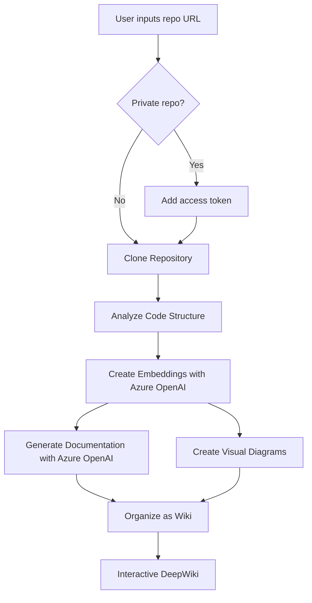

# Orcas CodeWiki (For MS Internal use)

> **Inspired by [DeepWiki-Open](https://github.com/AsyncFuncAI/deepwiki-open)** - This is a fork optimized exclusively for **Azure OpenAI** with Managed Identity authentication. No API keys or `.env` files needed!

**Orcas CodeWiki** automatically creates  interactive wikis for Azure DevOps repository! Just enter a repo url, and CodeWiki will:

1. Analyze the code structure
2. Generate comprehensive documentation
3. Create visual diagrams to explain how everything works
4. Organize it all into an easy-to-navigate wiki

## 🚀 Quick Start (if you want to deloy your own service)

### Prerequisites

- **Python 3.10+**
- **Node.js 18+**
- **Azure OpenAI Service** with deployed models:
  - Text generation model (e.g., `o4-mini`, `gpt-4o`)
  - Embedding model (e.g., `text-embedding-3-large`)
- **Azure Storage Blob container**
- **Managed Identity (MSI)** 
  - configured with access **Cognitive Services OpenAI User** to Azure OpenAI
  - configured with access **Monitoring Metrics Publisher** to Azure Blob
- **Application Insight** if you would like to emit logs to Azure 
- **Web App Service** 

### Step 1: Configure infra.json

Edit `backend/config/infra.json` with your Azure details:

```json
{
  "managed_identity": {
    "name": "your-msi-name",
    "client_id": "your-msi-client-id"
  },
  "azure_openai": {
    "endpoint": "https://your-resource.openai.azure.com",
    "api_version": "2024-12-01-preview",
    "deployment": "o4-mini"
  },
  "azure_openai_embedding": {
    "endpoint": "https://your-resource.openai.azure.com",
    "api_version": "2024-12-01-preview",
    "deployment": "text-embedding-3-large"
  },
  "azure_blob_storage": {
    "enabled": true,
    "account_name": "your-storage-account",
    "container_name": "deepwiki-data"
  },
  "azure_application_insights": {
    "enabled": true,
    "name": "your-app-insights",
    "connection_string": ""
  }
}
```

### Step 4: Install Dependencies

```bash
# Clone the repository

# Optional: create virutal environment and activate it
python -m venv .venv
.venv\scripts\activate   

# Install Poetry (if not already installed)
pip install poetry

# Install Python dependencies
poetry install

# Install JavaScript dependencies
npm install
```

### Step 5: Start the Application

```bash
# Terminal 1: Start the API server
python -m backend.main

# Terminal 2: Start the frontend
npm run dev
```

### Step 6: Use DeepWiki!

1. Open [http://localhost:3000](http://localhost:3000) in your browser
2. Enter a repository URL (e.g., `https://github.com/microsoft/autogen`)
3. Enter your personal access token
4. Click "Generate Wiki", it would take some time to generate wiki for large code base. You can check back on the homepage.

##  How It Works


```mermaid
graph TD
    A[User inputs repo URL] --> AA{Private repo?}
    AA -->|Yes| AB[Add access token]
    AA -->|No| B[Clone Repository]
    AB --> B
    B --> C[Analyze Code Structure]
    C --> D[Create Embeddings with Azure OpenAI]
    D --> E[Generate Documentation with Azure OpenAI]
    D --> F[Create Visual Diagrams]
    E --> G[Organize as Wiki]
    F --> G
    G --> H[Interactive DeepWiki]
```

DeepWiki uses Azure OpenAI to:

1. Clone and analyze the repository (including private repos with token authentication)
2. Create embeddings of the code using Azure OpenAI's `text-embedding-3-large`
3. Generate documentation using Azure OpenAI's GPT models
4. Create visual diagrams to explain code relationships
5. Organize everything into a structured wiki
6. Enable intelligent Q&A with the repository through the Ask feature

## 🛠️ Project Structure

```
deepwiki/
├── pyproject.toml        # Python dependencies (Poetry)
├── poetry.lock           # Poetry lock file
├── package.json          # Node.js dependencies
│
├── backend/              # Backend API server
│   ├── main.py           # API entry point
│   ├── api.py            # FastAPI implementation
│   ├── rag.py            # Retrieval Augmented Generation
│   ├── data_pipeline.py  # Data processing utilities
│   ├── azureai_client.py # Azure OpenAI client
│   └── config/           # Configuration files
│       ├── generator.json    # Model configuration
│       ├── embedder.json     # Embedding configuration
│       └── infra.json        # Infrastructure & MSI configuration
│
├── src/                  # Frontend Next.js app
│   ├── app/              # Next.js app directory
│   └── components/       # React components
│
├── img/                  # Images and screenshots
│   ├── public/           # Next.js public assets
│   └── screenshots/      # Documentation screenshots
│
└── logs/                 # Application logs
    ├── backend-*.log     # Backend logs (daily rotation)
    └── frontend-*.log    # Frontend logs (daily rotation)
```

## ⚙️ Configuration

All configuration is centralized in `backend/config/infra.json`. 

### infra.json Structure

| Field | Description |
|-------|-------------|
| `managed_identity.name` | Name of the User-Assigned Managed Identity |
| `managed_identity.client_id` | Client ID of the Managed Identity |
| `azure_openai.endpoint` | Azure OpenAI endpoint URL |
| `azure_openai.api_version` | API version (e.g., `2024-12-01-preview`) |
| `azure_openai.deployment` | Deployment name for text generation |
| `azure_openai_embedding.endpoint` | Azure OpenAI endpoint for embeddings |
| `azure_openai_embedding.api_version` | API version for embeddings |
| `azure_openai_embedding.deployment` | Deployment name for embeddings |
| `azure_blob_storage.enabled` | Enable Azure Blob Storage for persistence (`true`/`false`) |
| `azure_blob_storage.account_name` | Storage account name |
| `azure_blob_storage.container_name` | Blob container name (e.g., `deepwiki-data`) |
| `azure_application_insights.enabled` | Enable Application Insights for centralized logging (`true`/`false`) |
| `azure_application_insights.name` | Application Insights resource name |
| `azure_application_insights.connection_string` | Application Insights connection string |

### Other Configuration Files

- **`backend/config/generator.json`**: Text generation model parameters (temperature)
- **`backend/config/embedder.json`**: Embedding model and text processing settings

## 💾 Storage Architecture

DeepWiki supports two **mutually exclusive** storage modes:

### Storage Modes

| Mode | When | Use Case |
|------|------|----------|
| **Blob Mode** | `azure_blob_storage.enabled: true` | Production deployments (Azure Container Apps, etc.) |
| **Local Mode** | `azure_blob_storage.enabled: false` | Local development and testing |

> **Important**: These modes are mutually exclusive. There is NO syncing between blob and local storage.

### What Gets Stored

| Data | Description | Blob Path | Local Path |
|------|-------------|-----------|------------|
| **Repositories** | Cloned repository files | `repos/{repo_name}/` | `~/.adalflow/repos/{repo_name}/` |
| **Databases** | Embedded document databases (pkl) | `databases/{repo_name}.pkl` | `~/.adalflow/databases/{repo_name}.pkl` |
| **Wiki Cache** | Generated wiki content (JSON) | `wikicache/*.json` | `~/.adalflow/wikicache/*.json` |

### Local Working Directory

Even in **Blob Mode**, you may see files in `~/.adalflow/`. This is the **temporary working directory**:

```
~/.adalflow/
├── repos/                           # ← Temporary: downloaded from blob for processing
├── databases/                       # ← Not used in blob mode (blob is source of truth)
├── wikicache/                       # ← Not used in blob mode (blob is source of truth)
└── cache_AzureAIClient_*.db/        # ← Local-only LLM response cache (intentional)
```

**Why local copies exist in blob mode:**
- File parsing and embedding requires local file access
- FAISS index building reads files from disk
- The local copy is a **working cache**, not persistent storage

**Source of truth:**
- **Blob Mode**: Azure Blob Storage is the source of truth. Local is temporary.
- **Local Mode**: Local filesystem is the source of truth.

### LLM Response Cache

The `cache_AzureAIClient_*.db/` folder is **intentionally local-only**:
- Created by adalflow's DiskCache for caching LLM API responses
- Avoids redundant API calls for identical queries
- Machine-specific, ephemeral performance optimization
- Not persistent data - safe to delete anytime

## 📊 Logging

DeepWiki uses daily rotating log files with optional Azure Application Insights integration:

### Local Logs

- **Backend logs**: `logs/backend-YYMMDD.log`
- **Frontend logs**: `logs/frontend-YYMMDD.log`

Set logging level in your environment:

```bash
LOG_LEVEL=DEBUG  # DEBUG, INFO, WARNING, ERROR
```

### Application Insights (Optional)

For centralized cloud logging, configure Azure Application Insights:

1. **Create Application Insights** in Azure Portal
2. **Get the connection string** from the Application Insights overview page
3. **Configure in `infra.json`**:
   ```json
   "azure_application_insights": {
     "enabled": true,
     "name": "your-app-insights-name",
     "connection_string": "InstrumentationKey=...;IngestionEndpoint=..."
   }
   ```
4. **Assign role** - Your identity needs **"Monitoring Metrics Publisher"** role on the Application Insights resource:
   ```bash
   az role assignment create \
     --assignee <your-user-or-msi-object-id> \
     --role "Monitoring Metrics Publisher" \
     --scope <application-insights-resource-id>
   ```

**Authentication:**
- In Azure (VMs, Container Apps): Uses Managed Identity from `infra.json`
- Locally: Uses Azure CLI credentials (`az login`)

**View logs** in Azure Portal → Application Insights → Logs → Query the `traces` table:
```kusto
traces
| where cloud_RoleName == "backend"
| order by timestamp desc
| take 100
```

## 🤖 Ask & DeepResearch Features

### Ask Feature

Chat with your repository using RAG (Retrieval Augmented Generation):

- **Context-Aware**: Get accurate answers based on the actual code
- **Real-Time Streaming**: See responses as they're generated
- **Conversation History**: Maintains context between questions

### DeepResearch Feature

Multi-turn research for complex topics:

- **In-Depth Investigation**: Multiple research iterations
- **Structured Process**: Clear research plan with updates
- **Comprehensive Conclusion**: Final answer based on all iterations

Toggle "Deep Research" in the Ask interface for thorough analysis.

## 📱 Screenshots


*The main interface of DeepWiki*


*Sample Wiki generated*


*DeepResearch conducts multi-turn investigations*

## Limitation (Working in progress)
- Multi-threaded: Currently, if there is already an ongoing code embedding process running, other newly coming request will be queued. In future, CodeWiki will allow multi-threaded chunking process.
- Timely scheduled pipeline: with development of any code projects, code repo will change time to time. To ensure accuracy with Wiki generated, need to have a scheduled pipeline to analyze the code changes time to time.