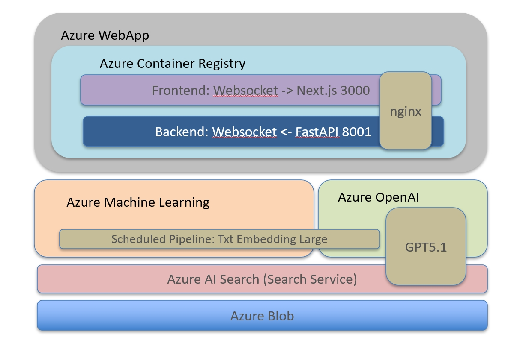
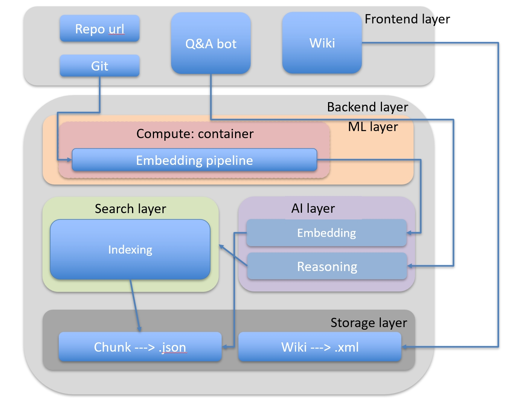
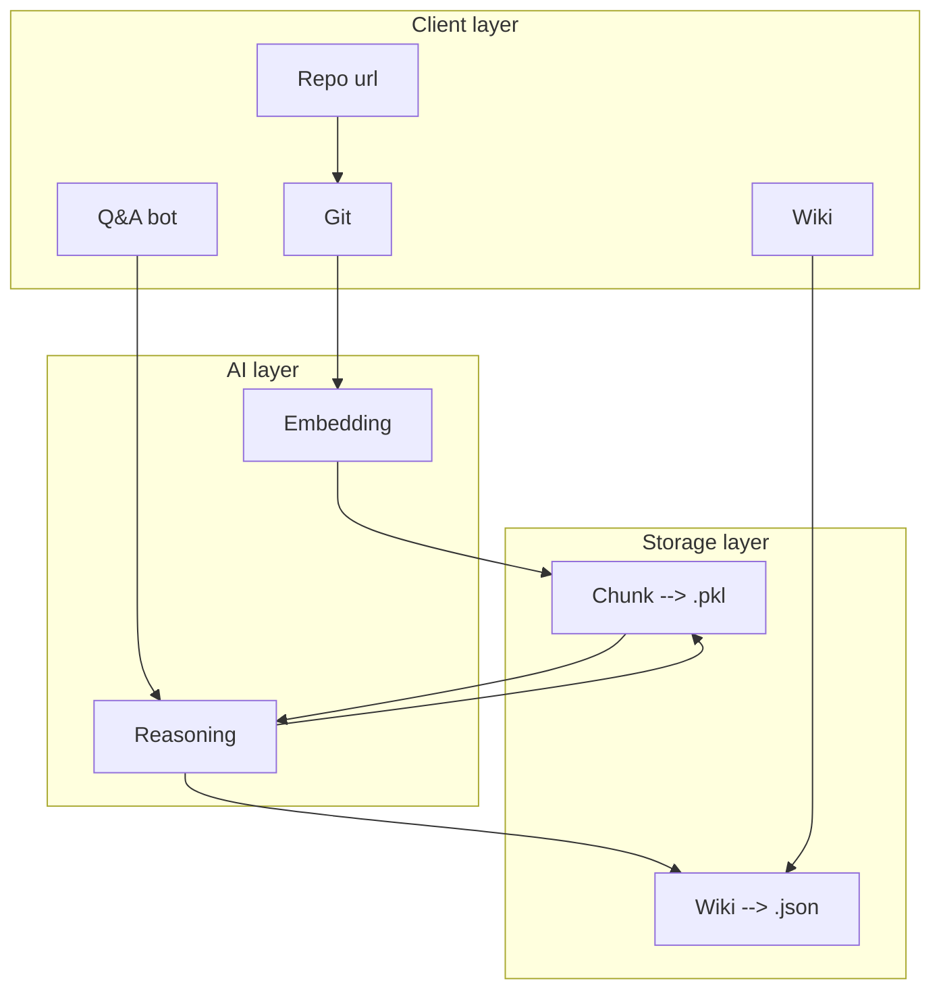

# Orcas CodeWiki

> **Inspired by [Orcas CodeWiki-Open](https://github.com/AsyncFuncAI/Orcas CodeWiki-open)** — Fork optimized for **Azure OpenAI** with Managed Identity authentication.

**Orcas CodeWiki** automatically generates interactive wikis for Azure DevOps repositories. Enter a repo URL and CodeWiki will analyze the code structure, generate comprehensive documentation with visual diagrams, and organize it into a navigable wiki.

The general workflow is:

1. Clone and analyze the repository (Azure DevOps with PAT authentication)
2. Create embeddings of the code using Azure OpenAI's `text-embedding-3-large`
3. Store embeddings as individual JSON files per chunk (memory-efficient)
4. Generate documentation using Azure OpenAI's GPT models
5. Create visual diagrams to explain code relationships
6. Organize everything into a structured wiki
7. Enable intelligent Q&A with the repository through the Ask feature

## Architecture V2 (Current)

```
┌──────────────────────────────────────────────────────────────────────┐
│  User's Machine                                                      │
│                                                                      │
│  code_processor (local/docker)    aml_dispatcher (cloud setup)       │
│  ┌─ clone ─ embed ─ wiki ─ save  ┌─ write .cloud/ config            │
│  │  PAT / az login               │  setup AML compute + pipeline    │
│  │  FAISS, local disk            │  create AI Search index          │
│  └───────────────────────────────└───────────────────────────────────┘
│                                           │
│                                    AML Pipeline (scheduled)
│                                           │
│  ┌────────────────────────────────────────▼──────────────────────────┐
│  │  AML Compute (cloud mode)                                         │
│  │  code_processor --mode=cloud                                      │
│  │  ┌─ clone (UMI) ─ embed (→blob) ─ wiki (AI Search) ─ save (→blob)│
│  └───────────────────────────────────────────────────────────────────┘
│                                           │
│  ┌────────────────────────────────────────▼──────────────────────────┐
│  │  Azure Web App (viewer + chatbot)                                 │
│  │  Next.js :3001 ─ nginx :3000 ─ FastAPI :8001                     │
│  │  Reads wiki from blob, Ask/Chat via AI Search                     │
│  └───────────────────────────────────────────────────────────────────┘
```
### Stack



### Flow



### Three Processing Modes

| Mode | Config | Auth | Storage | Retrieval | Command |
|------|--------|------|---------|-----------|---------|
| **local** | `config/` | PAT or `az login` | Local disk | FAISS | `python -m backend.processor.code_processor --config=backend/run.json` |
| **docker** | `config/.local/` | PAT only | Local disk | FAISS | `python -m backend.processor.code_processor --mode=docker --repo=URL --branch=main` |
| **cloud** | `config/.cloud/` | UMI | Azure Blob | AI Search | `python -m backend.processor.aml_dispatcher --config=backend/run.json` |

### Project Structure

```
backend/
├── processor/          # CLI wiki generator + AML dispatcher
├── modules/
│   ├── repository/     # Git clone, pull, commit hash
│   ├── embedder/       # Chunking, embedding, FAISS/AI Search retrieval
│   ├── wiki/           # Wiki cache read/write/export
│   └── chat/           # Ask/Chat Q&A (WebSocket + HTTP streaming)
├── clients/            # Azure OpenAI, Blob, AI Search, Storage abstraction
├── promptstore/        # LLM prompt templates
├── config/             # JSON config files (infra.json, embedder.json, etc.)
└── app.py              # FastAPI server (7 endpoints for chat + wiki API)

src/                    # Next.js frontend (wiki viewer + Ask/Chat UI)
Deployments/            # ARM templates for Azure resource provisioning
```

For detailed module documentation, see:
- [backend/README.md](backend/README.md) — Backend overview and FastAPI endpoints
- [backend/processor/README.md](backend/processor/README.md) — Processor modes, step functions, cloud setup
- [backend/modules/chat/README.md](backend/modules/chat/README.md) — WebSocket/HTTP chat, deep research
- [backend/modules/embedder/README.md](backend/modules/embedder/README.md) — Code splitting, embedding, FAISS retrieval
- [backend/modules/repository/README.md](backend/modules/repository/README.md) — Git operations
- [backend/modules/wiki/README.md](backend/modules/wiki/README.md) — Wiki cache, data models, export

> **Architecture Note**: The backend uses a modular architecture with clear separation of concerns:
> - **modules/**: Domain-specific business logic
> - **clients/**: External service integrations
> - **promptstore/**: LLM prompt templates (single source of truth)
> - **types/**: Shared type definitions
> 
> See [backend/README.md](backend/README.md) for detailed module documentation.

## Quick Start

### Prerequisites

- **Python 3.10+**, **Node.js 18+**, **Docker**
- Azure resources (see [Azure Resources](#azure-resources) below) if you are deploying in Azure environment

### 1. Deploy Azure Resources (Skip if you are running locally)

1. Edit `Deployments/config.py` with resource names
2. Run `Deployments/deploy_required.ipynb` to provision resources based information provided in `config.py` above.

> Note #1: <br>
> Below listed required Azure resources for refence or if you want to deploy manually. 
> 
> | Resource | Purpose |
> |----------|---------|
> | **Azure OpenAI** | Text generation (gpt-5.1/o4-mini) + embeddings (text-embedding-3-large) |
> | **Azure Blob Storage** | Store vectors, wiki cache, repos (cloud mode) |
> | **Managed Identity (UMI)** | Authenticate between Azure resources |
> | **Azure Machine Learning** | Scheduled processing pipeline (cloud mode) |
> | **Azure AI Search** | Vector search for wiki generation + chatbot (cloud mode) |
> | **Application Insights** | Telemetry and logging (optional) |

> NOTE #2: **Permissions Needed** <br>
> See [Permissions Requirements](./Deployments/permission.md) for RBAC reference. Those should be auto granted when deploying using the runbook.

> NOTE #3: Security Requirements [**IMPORTANT**] <br>
> **Security Handling** applied if deploy using above runbook. Refer to below if want to handle it manually:
> 
> 1. Public access should be disabled for below resources:
>    - blob storage
>    - keyvault, if any
>
>     Instead, create a NSP (Network Security Perimeter) associate to above resources those who disable public access. And add below rules in NSP:
>    - inbound: allow your subscriptions, allow service tag "MicrosoftPublicIPSpace"
>    - outbound: allow * FQDNs
> 
> 2. For Web App:
>    - Create identity provider following: [Quickstart: Add app authentication](https://learn.microsoft.com/en-us/azure/app-service/scenario-secure-app-authentication-app-service?tabs=workforce-configuration)
>    - Create Network Access rule to allow CorpNet using service tag "CorpNetPublic"
>
> Some of above security values are ONLY available in production tenant if deploying in Portal. <br>
> However, you may want to try using ARM to pass in those values using API, which should be accepted.

### 2. Configure infra.json

Edit `backend/config/infra.json` with your Azure endpoints:

```json
{
  "managed_identity": {
    "name": "your-msi-name",
    "client_id": "your-msi-client-id"
  },
  "azure_openai": {
    "endpoint": "https://your-resource.openai.azure.com",
    "api_version": "2025-04-01-preview",
    "deployment": "gpt-5.1"
  },
  "azure_openai_embedding": {
    "endpoint": "https://your-resource.openai.azure.com",
    "api_version": "2024-12-01-preview",
    "deployment": "text-embedding-3-large",
    "dimensions": 3072
  },
  "azure_blob_storage": {
    "enabled": false,
    "account_name": "your-storage-account",
    "container_name": "Orcas CodeWiki-data"
  },
  "azure_ai_search": {
    "enabled": false,
    "endpoint": "https://your-search.search.windows.net"
  }
}
```

> [**IMPORTANT**] <br>
> Keep `enabled: false` for blob/search/AML when running locally. Cloud services are auto-enabled via config overlays (`.cloud/` directory) when using `aml_dispatcher` or `publish-web.ps1`.

### 3. Start Web App

#### Option 1: Local 

```bash
# Create virtual environment
python -m venv .venv
.venv\scripts\activate

# Install dependencies
pip install poetry && poetry install
npm install

# Terminal 1: Start backend - in V2, only used for Chat Q&A bot 
python -m backend.main

# Terminal 2: Start frontend
npm run dev

# Open http://localhost:3000
```

#### Option 2: Docker Local Test

```powershell
# Copy sample.env to .env and add your Azure OpenAI API key
.\test-local.ps1
```

#### Option 3: Deploy to Azure Web App

```powershell
# Ensure Deployments/config.py has correct resource names
.\publish-web.ps1
```

### 4. WIKI Generation flow (standalone process sided by web app)

The Web App started via above but you need WIKI generation flow via below options:

#### Option 1: Generate Wiki Locally

```bash
# With config file
python -m backend.processor.code_processor --config=backend/run.json

# With CLI args
export REPO_ACCESS_TOKEN="your-pat"
python -m backend.processor.code_processor \
    --repo="https://dev.azure.com/org/proj/_git/repo" \
    --branch=main --mode=local
```

#### Option 2: Generate Wiki in Docker

```bash
# With config file
python -m backend.processor.code_processor --config=backend/run.json

# With CLI args
export REPO_ACCESS_TOKEN="your-pat"
python -m backend.processor.code_processor \
    --repo="https://dev.azure.com/org/proj/_git/repo" \
    --branch=main --mode=docker
```

#### Option 3 Cloud Processing (AML Pipeline)

```bash
# Setup AML resources and create scheduled pipeline (run once)
python -m backend.processor.aml_dispatcher --config=backend/run.json

# AML pipeline runs code_processor --mode=cloud automatically on schedule
```


## Architecture V1 (Deprecated)

<details>

### Docker Architecture 

This project uses a single `Dockerfile` with nginx for both local testing and Azure deployment:

| File | Purpose | nginx | Use Case |
|------|---------|-------|----------|
| `Dockerfile` | All environments | ✅ Yes | Local testing (`test-local.ps1`) and Azure deployment |

**Why nginx?**

Azure Container Apps has a **240-second hard limit** on HTTP request timeouts. Large repository embedding can take 30-60+ minutes, which would fail with 504 Gateway Timeout errors.

The nginx reverse proxy enables **WebSocket connections** which bypass HTTP timeout limits:

```
┌─────────────────────────────────────────────────────────────────┐
│                         Container                                │
│                                                                  │
│   External :3000                                                 │
│        │                                                         │
│        ▼                                                         │
│   ┌─────────┐     /ws/*      ┌──────────────────────────┐       │
│   │  nginx  │ ────────────▶  │   FastAPI Backend :8001  │       │
│   │         │  (WebSocket)   │   - Wiki generation      │       │
│   │         │                │   - Chat API             │       │
│   │         │     /*         │   - Embeddings           │       │
│   │         │ ────────────▶  └──────────────────────────┘       │
│   │         │  (HTTP)                                            │
│   │         │                ┌──────────────────────────┐       │
│   │         │ ────────────▶  │   Next.js Frontend :3001 │       │
│   └─────────┘                │   - UI/React app         │       │
│                              └──────────────────────────┘       │
└─────────────────────────────────────────────────────────────────┘
```

**nginx configuration highlights** (`nginx.conf`):
- WebSocket timeout: 7 days (for long-running embedding operations)
- HTTP timeout: 1 hour
- Proper WebSocket upgrade headers for `/ws/` routes

### Deployment Architecture

```
┌─────────────────────────────────────────────────────────────────┐
│                    Azure Container Apps                          │
│  ┌─────────────────────────────────────────────────────────┐   │
│  │              codewiki (Container App)                    │   │
│  │  ┌─────────────────┐    ┌──────────────────────────┐   │   │
│  │  │   Next.js       │    │       FastAPI            │   │   │
│  │  │   Frontend      │───▶│       Backend            │   │   │
│  │  │   :3001         │    │       :8001              │   │   │
│  │  └─────────────────┘    └──────────────────────────┘   │   │
│  │           ▲                        ▲                    │   │
│  │           └────────┬───────────────┘                    │   │
│  │                    │                                    │   │
│  │              ┌─────┴─────┐                              │   │
│  │              │   nginx   │ ◀── External :3000           │   │
│  │              └───────────┘                              │   │
│  └─────────────────────────────────────────────────────────┘   │
│                              │                                   │
│                    Managed Identity                              │
│                              │                                   │
└──────────────────────────────┼───────────────────────────────────┘
                               │
         ┌─────────────────────┼─────────────────────┐
         │                     │                     │
         ▼                     ▼                     ▼
┌─────────────────┐  ┌─────────────────┐  ┌─────────────────┐
│  Azure OpenAI   │  │  Azure Blob     │  │  Application    │
│  - GPT Models   │  │  Storage        │  │  Insights       │
│  - Embeddings   │  │  - Wiki Data    │  │  - Logs         │
└─────────────────┘  └─────────────────┘  └─────────────────┘
```

###  How It Works


```mermaid
flowchart TB
    %% ===== Client Layer =====
    subgraph Client["Client layer"]
        Repo["Repo url"]
        Git["Git"]
        QABot["Q&A bot"]
        WikiClient["Wiki"]

        Repo --> Git
    end

    %% ===== AI Layer =====
    subgraph AI["AI layer"]
        Embedding["Embedding"]
        Reasoning["Reasoning"]
    end

    %% ===== Storage Layer =====
    subgraph Storage["Storage layer"]
        Chunk["Chunk --> .pkl"]
        WikiJson["Wiki --> .json"]
    end

    %% ===== Flows =====
    Git --> Embedding
    Embedding --> Chunk

    Chunk --> Reasoning
    Reasoning --> Chunk

    QABot --> Reasoning
    Reasoning --> WikiJson

    WikiClient --> WikiJson

```
</details>

## Useful Azure CLI Commands

```bash
# View Web App logs (live streaming)
az webapp log tail -n codewiki -g RG-ORCAS-Orcas CodeWiki

# Restart the Web App
az webapp restart -n codewiki -g RG-ORCAS-Orcas CodeWiki

# View deployment logs
az webapp log deployment show -n codewiki -g RG-ORCAS-Orcas CodeWiki

# Get Web App URL
az webapp show -n codewiki -g RG-ORCAS-Orcas CodeWiki --query defaultHostName -o tsv

# Check Web App status
az webapp show -n codewiki -g RG-ORCAS-Orcas CodeWiki --query state -o tsv

# Scale up (change App Service Plan tier)
az appservice plan update -n codewiki-plan -g RG-ORCAS-Orcas CodeWiki --sku P2v3

# Scale out (add instances)
az webapp update -n codewiki -g RG-ORCAS-Orcas CodeWiki --set siteConfig.numberOfWorkers=3

# View current configuration
az webapp config show -n codewiki -g RG-ORCAS-Orcas CodeWiki

# SSH into the container
az webapp ssh -n codewiki -g RG-ORCAS-Orcas CodeWiki
```

## ⚙️ Configuration file explanation

All configuration is centralized in `backend/config/infra.json`. 

### infra.json Structure

| Field | Description |
|-------|-------------|
| `managed_identity.name` | Name of the User-Assigned Managed Identity |
| `managed_identity.client_id` | Client ID of the Managed Identity |
| `azure_openai.endpoint` | Azure OpenAI endpoint URL |
| `azure_openai.api_version` | API version (e.g., `2024-12-01-preview`) |
| `azure_openai.deployment` | Deployment name for text generation |
| `azure_openai_embedding.endpoint` | Azure OpenAI endpoint for embeddings |
| `azure_openai_embedding.api_version` | API version for embeddings |
| `azure_openai_embedding.deployment` | Deployment name for embeddings |
| `azure_blob_storage.enabled` | Enable Azure Blob Storage for persistence (`true`/`false`) |
| `azure_blob_storage.account_name` | Storage account name |
| `azure_blob_storage.container_name` | Blob container name (e.g., `Orcas CodeWiki-data`) |
| `azure_application_insights.enabled` | Enable Application Insights for centralized logging (`true`/`false`) |
| `azure_application_insights.name` | Application Insights resource name |
| `azure_application_insights.connection_string` | Application Insights connection string |

### Other Configuration Files

- **`backend/config/generator.json`**: Text generation model parameters (temperature)
- **`backend/config/embedder.json`**: Embedding model and text processing settings

## 💾 Storage Architecture

CodeWiki supports two **mutually exclusive** storage modes:

### Storage Modes

| Mode | When | Use Case |
|------|------|----------|
| **Blob Mode** | `azure_blob_storage.enabled: true` | Production deployments (Azure Container Apps, etc.) |
| **Local Mode** | `azure_blob_storage.enabled: false` | Local development and testing |

> **Important**: These modes are mutually exclusive. There is NO syncing between blob and local storage.

### What Gets Stored

| Data | Description | Blob Path | Local Path |
|------|-------------|-----------|------------|
| **Repositories** | Cloned repository files | `repos/{repo_name}/` | `~/.adalflow/repos/{repo_name}/` |
| **Vectors** | Embedded document vectors (JSON) | `vectors/{repo_name}_{branch}/` | `~/.adalflow/vectors/{repo_name}_{branch}/` |
| **Wiki Cache** | Generated wiki content (JSON) | `wikicache/*.json` | `~/.adalflow/wikicache/*.json` |
| **Embedding Cache** | Cached embeddings | `embedding_cache/` | `~/.adalflow/embedding_cache/` |

> **Note**: The backend uses `~/.adalflow/` consistently on all platforms (Windows, Linux, macOS) to ensure Docker volume mounting works correctly. This differs from adalflow's default `%APPDATA%/adalflow` on Windows.

### Local Working Directory

```
~/.adalflow/
├── repos/           # ← Temporary: downloaded from blob for processing
├── vectors/         # ← Not used in blob mode (blob is source of truth)
├── wikicache/       # ← Not used in blob mode (blob is source of truth)
├── embedding_cache/ # ← Cached embeddings to avoid recomputation
└── cache_AzureAIClient_*.db/  # ← Local-only LLM response cache (intentional)
```

**Authentication:**
- In Azure (VMs, Container Apps): Uses Managed Identity from `infra.json`
- Locally: Uses Azure CLI credentials (`az login`)

## 🤖 Ask & DeepResearch Features

### Ask Feature

Chat with your repository using RAG (Retrieval Augmented Generation):

- **Context-Aware**: Get accurate answers based on the actual code
- **Real-Time Streaming**: See responses as they're generated
- **Conversation History**: Maintains context between questions

### DeepResearch Feature

Multi-turn research for complex topics:

- **In-Depth Investigation**: Multiple research iterations
- **Structured Process**: Clear research plan with updates
- **Comprehensive Conclusion**: Final answer based on all iterations

Toggle "Deep Research" in the Ask interface for thorough analysis.

## 📱 Screenshots


*The main interface of Orcas CodeWiki*


*Sample Wiki generated*


*DeepResearch conducts multi-turn investigations*

## Limitation (Working in progress)
- CodeMap: allows to show function callstack
