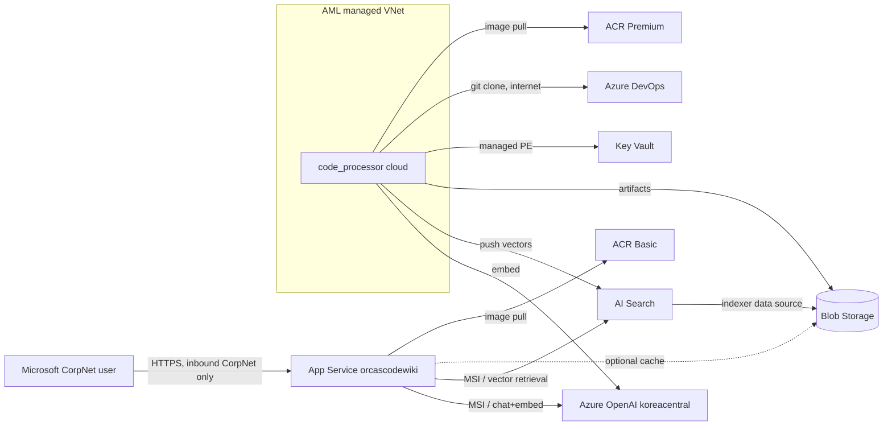
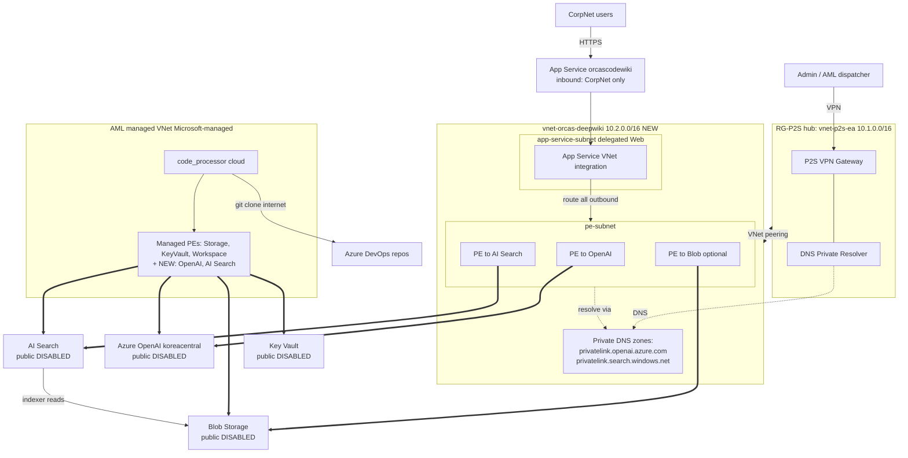
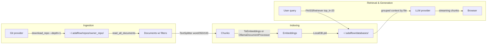
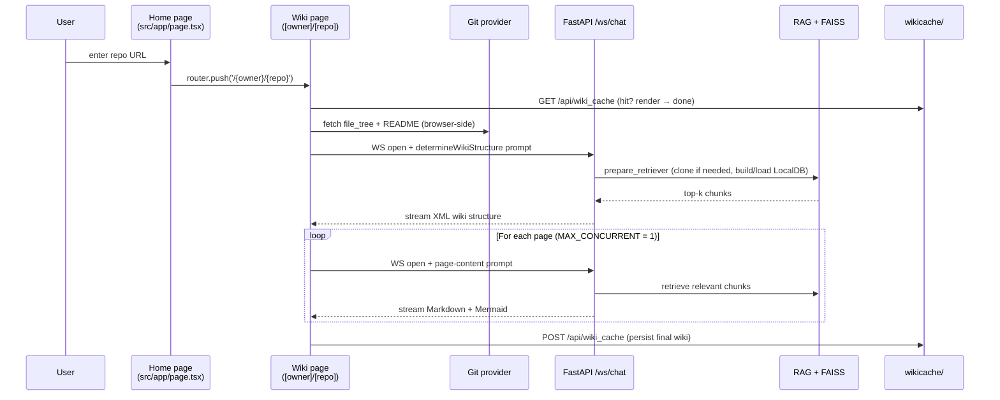
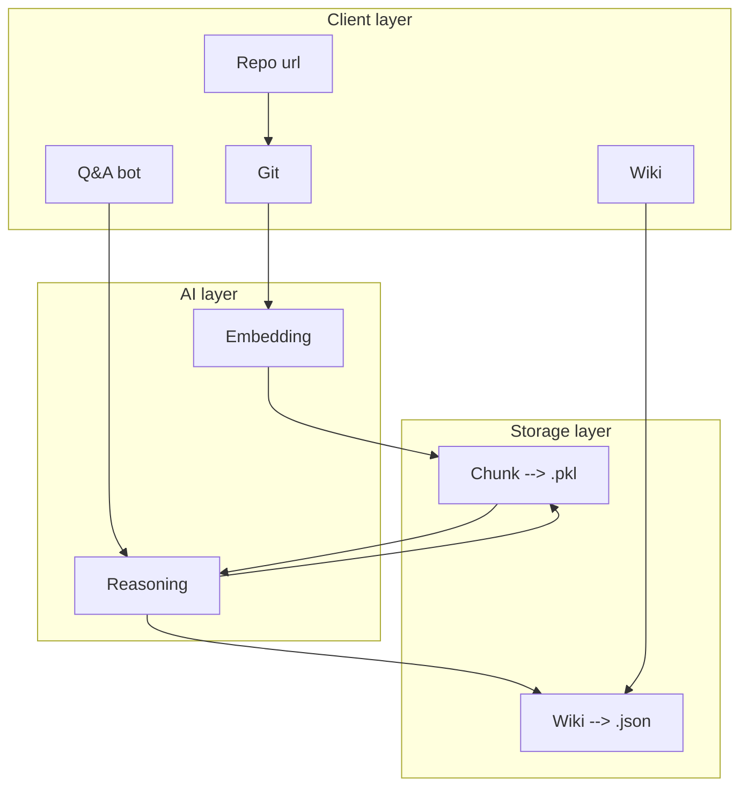

# Orcas CodeWiki

> **Inspired by [deepwiki-open](https://github.com/AsyncFuncAI/deepwiki-open)** — Fork optimized for **Azure OpenAI** with Managed Identity authentication.

**Orcas CodeWiki** automatically generates interactive wikis for Azure DevOps repositories. Enter a repo URL and CodeWiki will analyze the code structure, generate comprehensive documentation with visual diagrams, and organize it into a navigable wiki.

The general workflow is:

1. Clone and analyze the repository (Azure DevOps with PAT authentication)
2. Create embeddings of the code using Azure OpenAI's `text-embedding-3-large`
3. Store embeddings as individual JSON files per chunk (memory-efficient)
4. Generate documentation using Azure OpenAI's GPT models
5. Create visual diagrams to explain code relationships
6. Organize everything into a structured wiki
7. Enable intelligent Q&A with the repository through the Ask feature

### Branch Policy

| Branch | Purpose | Status |
|--------|---------|--------|
| `main` | Original upstream public branch (fork origin) | **Do not modify.** Not maintained or updated. Do not contribute to this branch. |
| `orcas` | Production-ready branch with V2 architecture designed | **Active development.** All new work targets this branch. |
| `orcas-release-v1` | Last stable release on V1 architecture | **Frozen.** Reference only. |

## Architecture V2 (Current)

```
┌──────────────────────────────────────────────────────────────────────┐
│  User's Machine                                                      │
│                                                                      │
│  code_processor (local/docker)    aml_dispatcher (cloud setup)       │
│  ┌─ clone ─ embed ─ wiki ─ save  ┌─ write .cloud/ config            │
│  │  PAT / az login               │  setup AML compute + pipeline    │
│  │  FAISS, local disk            │  create AI Search index          │
│  └───────────────────────────────└───────────────────────────────────┘
│                                           │
│                                    AML Pipeline (scheduled)
│                                           │
│  ┌────────────────────────────────────────▼──────────────────────────┐
│  │  AML Compute (cloud mode)                                         │
│  │  code_processor --mode=cloud                                      │
│  │  ┌─ clone (UMI) ─ embed (→blob) ─ wiki (AI Search) ─ save (→blob)│
│  └───────────────────────────────────────────────────────────────────┘
│                                           │
│  ┌────────────────────────────────────────▼──────────────────────────┐
│  │  Azure Web App (viewer + chatbot)                                 │
│  │  Next.js :3001 ─ nginx :3000 ─ FastAPI :8001                     │
│  │  Reads wiki from blob, Ask/Chat via AI Search                     │
│  └───────────────────────────────────────────────────────────────────┘
```
### Stack


### Flow


### Public Network Topology Diagram (Depercated)

<details>


```mermaid
flowchart LR
  User[Microsoft CorpNet user] -->|HTTPS, inbound CorpNet only| APP[App Service orcascodewiki]
  APP -->|MSI / chat+embed| AOAI[Azure OpenAI koreacentral]
  APP -->|MSI / vector retrieval| ACS[AI Search]
  APP -.->|optional cache| BLOB[(Blob Storage)]
  APP -->|image pull| ACR1[ACR Basic]

  subgraph AMLNET[AML managed VNet]
    PROC[code_processor cloud]
  end
  PROC -->|embed| AOAI
  PROC -->|push vectors| ACS
  PROC -->|artifacts| BLOB
  PROC -->|managed PE| KV[Key Vault]
  PROC -->|git clone, internet| ADO[Azure DevOps]
  PROC -->|image pull| ACR2[ACR Premium]
  ACS -->|indexer data source| BLOB
```

</details>

### Private Network Topology Diagram 


```mermaid
flowchart TB
    USER["CorpNet users"]
    ADMIN["Admin / AML dispatcher"]

    subgraph HUB["RG-P2S hub: vnet-p2s-ea 10.1.0.0/16"]
        VPNGW["P2S VPN Gateway"]
        RESOLVER["DNS Private Resolver"]
    end

    subgraph DWVNET["vnet-orcas-deepwiki 10.2.0.0/16 NEW"]
        subgraph APPSUB["app-service-subnet delegated Web"]
            VNETINT["App Service VNet integration"]
        end
        subgraph PESUB["pe-subnet"]
            PEAOAI["PE to OpenAI"]
            PEACS["PE to AI Search"]
            PEBLOB["PE to Blob optional"]
        end
        DNSZ["Private DNS zones:<br/>privatelink.openai.azure.com<br/>privatelink.search.windows.net"]
    end

    subgraph AMLNET["AML managed VNet Microsoft-managed"]
        PROC["code_processor cloud"]
        MPE["Managed PEs: Storage, KeyVault, Workspace<br/>+ NEW: OpenAI, AI Search"]
    end

    APP["App Service orcascodewiki<br/>inbound: CorpNet only"]

    AOAI["Azure OpenAI koreacentral<br/>public DISABLED"]
    ACS["AI Search<br/>public DISABLED"]
    BLOB["Blob Storage<br/>public DISABLED"]
    KV["Key Vault<br/>public DISABLED"]
    ADO["Azure DevOps repos"]

    USER -->|HTTPS| APP
    ADMIN -->|VPN| VPNGW
    VPNGW --- RESOLVER
    HUB <-->|VNet peering| DWVNET
    RESOLVER -.->|DNS| DNSZ

    APP --> VNETINT
    VNETINT -->|route all outbound| PESUB
    PESUB -.->|resolve via| DNSZ

    PEAOAI ==> AOAI
    PEACS ==> ACS
    PEBLOB ==> BLOB

    PROC --> MPE
    MPE ==> AOAI
    MPE ==> ACS
    MPE ==> BLOB
    MPE ==> KV
    PROC -->|git clone internet| ADO
    ACS -->|indexer reads| BLOB
```

### Three Processing Modes

| Mode | Config | Auth | Storage | Retrieval | Command |
|------|--------|------|---------|-----------|---------|
| **local** | `config/` | PAT or `az login` | Local disk | FAISS | `python -m backend.processor.code_processor --config=backend/run.json` |
| **docker** | `config/.local/` | PAT only | Local disk | FAISS | `python -m backend.processor.code_processor --mode=docker --repo=URL --branch=main` |
| **cloud** | `config/.cloud/` | UMI | Azure Blob | AI Search | `python -m backend.processor.aml_dispatcher --config=backend/run.json` |

### Authentication Matrix

Authentication varies by environment and service. The system auto-detects the environment via `NODE_ENV` and selects the correct auth method.

#### Azure OpenAI (Chat, Reasoning, Embedding)

| Environment | Auth Method | How It Works |
|-------------|------------|--------------|
| **Local Terminal** | Azure CLI identity (`az login`) | `DefaultAzureCredential` → `AzureCliCredential`. API key in `.env` is **ignored** to avoid key-disabled errors. |
| **Local Docker** | API Key | `AZURE_OPENAI_API_KEY` env var passed to container. Set in `backend/.env` or via `test-local.ps1 -ApiKey`. |
| **Azure Web App** | Managed Identity (UMI) | `AZURE_CLIENT_ID` set in App Settings → `DefaultAzureCredential` with `managed_identity_client_id`. Requires `Cognitive Services OpenAI User` role. |


**Detection logic** ([`azureai_client.py`](backend/clients/azureai_client.py) `_should_use_api_key()`):
- `NODE_ENV != production` → local terminal → always use identity (ignore API key)
- `NODE_ENV == production` + `AZURE_CLIENT_ID` set → MSI
- `NODE_ENV == production` + no MSI → API key fallback (Docker)

#### Azure DevOps Repos (Git Clone)

| Environment | Auth Method | How It Works |
|-------------|------------|--------------|
| **Local Terminal** | Git Credential Manager | Uses system git credentials (Windows Credential Manager / `az login` cached). No PAT needed if already authenticated. |
| **Local Terminal** | PAT (optional) | `REPO_ACCESS_TOKEN` in `backend/.env`. Used when Credential Manager is unavailable. |
| **Local Docker** | PAT | `REPO_ACCESS_TOKEN` env var passed to container. Required — Docker has no credential manager. |
| **Azure Web App** | Not used | Repos are pre-cloned by the processor. Web App reads from blob storage. |
| **AML Compute** | UMI | Git clone uses `https://{UMI_token}@dev.azure.com/...`. Token obtained via Managed Identity with `499b84ac-1321-427f-aa17-267ca6975798` scope. |


### Model Routing

Different tasks use different Azure OpenAI deployments configured in `infra.json`:

```json
"azure_openai": {
  "chat":      { "deployment": "gpt-5.1-chat" },
  "reasoning": { "deployment": "gpt-5.4" },
  "embedding": { "deployment": "text-embedding-3-large" }
}
```

| Task | Model Type | Deployment | Why |
|------|-----------|------------|-----|
| Chat Q&A | Chat | `gpt-5.1-chat` | Fast, low latency for interactive conversations |
| Deep Research | Reasoning | `gpt-5.4` | Multi-turn investigation benefits from deeper reasoning |
| Wiki Structure | Reasoning | `gpt-5.4` | Architectural planning across large codebases |
| Wiki Pages | Reasoning | `gpt-5.4` | Technical documentation with diagrams and citations |
| Embedding | Embedding | `text-embedding-3-large` | 3072-dimension vectors for code search |

### Project Structure

```
backend/
├── processor/          # CLI wiki generator + AML dispatcher
├── modules/
│   ├── repository/     # Git clone, pull, commit hash
│   ├── embedder/       # Chunking, embedding, FAISS/AI Search retrieval
│   ├── wiki/           # Wiki cache read/write/export
│   ├── chat/           # Ask/Chat Q&A (WebSocket + HTTP streaming)
│   ├── codemap/        # Static AST symbol/dependency graph (tree-sitter)
│   └── codetrace/      # LLM-powered query-driven code flow trace
├── clients/            # Azure OpenAI, Blob, AI Search, Storage abstraction
├── promptstore/        # LLM prompt templates
├── utils/              # url_builder, filter, sanitizer
├── config/             # JSON config files (infra.json, embedder.json, etc.)
├── app.py              # FastAPI app object (10 endpoints: chat + wiki + codemap + codetrace + health)
└── main.py             # uvicorn launcher (imports `app` from app.py)

src/                    # Next.js frontend (wiki viewer + Ask/Chat UI)
Deployments/            # ARM templates for Azure resource provisioning
```

For detailed module documentation, see:
- [backend/README.md](backend/README.md) — Backend overview and FastAPI endpoints
- [backend/processor/README.md](backend/processor/README.md) — Processor modes, step functions, cloud setup
- [backend/modules/chat/README.md](backend/modules/chat/README.md) — WebSocket/HTTP chat, deep research
- [backend/modules/embedder/README.md](backend/modules/embedder/README.md) — Code splitting, embedding, FAISS retrieval
- [backend/modules/repository/README.md](backend/modules/repository/README.md) — Git operations
- [backend/modules/wiki/README.md](backend/modules/wiki/README.md) — Wiki cache, data models, export
- [backend/modules/codemap/README.md](backend/modules/codemap/README.md) — Static symbol graph (tree-sitter AST, interactive visualization)
- [backend/modules/codetrace/README.md](backend/modules/codetrace/README.md) — AI code flow tracing (RAG + LLM, 3-panel page)
- [src/components/DESIGN.md](src/components/DESIGN.md) — Frontend architecture, component reference, Mermaid rendering pipeline

> **Architecture Note**: The backend uses a modular architecture with clear separation of concerns:
> - **modules/**: Domain-specific business logic
> - **clients/**: External service integrations
> - **promptstore/**: LLM prompt templates (single source of truth)
> - **types/**: Shared type definitions
> 
> See [backend/README.md](backend/README.md) for detailed module documentation.

## Quick Start

### Prerequisites

- **Python 3.10+**, **Node.js 18+**, **Docker**
- Azure resources (see [Azure Resources](#azure-resources) below) if you are deploying in Azure environment

### 1. Deploy Azure Resources (Skip if you are running locally)

1. Edit `Deployments/config.py` with resource names
2. Run `Deployments/deploy_required.ipynb` to provision resources based information provided in `config.py` above.

> Note #1: <br>
> Below listed required Azure resources for refence or if you want to deploy manually. 
> 
> | Resource | Purpose |
> |----------|---------|
> | **Azure OpenAI** | Text generation (gpt-5.1/o4-mini) + embeddings (text-embedding-3-large) |
> | **Azure Blob Storage** | Store vectors, wiki cache, repos (cloud mode) |
> | **Managed Identity (UMI)** | Authenticate between Azure resources |
> | **Azure Machine Learning** | Scheduled processing pipeline (cloud mode) |
> | **Azure AI Search** | Vector search for wiki generation + chatbot (cloud mode) |
> | **Application Insights** | Telemetry and logging (optional) |

> NOTE #2: **Permissions Needed** <br>
> See [Permissions Requirements](./Deployments/permission.md) for RBAC reference. Those should be auto granted when deploying using the runbook.

> NOTE #3: Security Requirements [**IMPORTANT**] <br>
> **Security Handling** applied if deploy using above runbook. Refer to below if want to handle it manually:
> 
> 1. Public access should be disabled for below resources:
>    - blob storage
>    - keyvault, if any
>
>     Instead, create a NSP (Network Security Perimeter) associate to above resources those who disable public access. And add below rules in NSP:
>    - inbound: allow your subscriptions, allow service tag "MicrosoftPublicIPSpace"
>    - outbound: allow * FQDNs
> 
> 2. For Web App:
>    - Create identity provider following: [Quickstart: Add app authentication](https://learn.microsoft.com/en-us/azure/app-service/scenario-secure-app-authentication-app-service?tabs=workforce-configuration)
>    - Create Network Access rule to allow CorpNet using service tag "CorpNetPublic"
>
> Some of above security values are ONLY available in production tenant if deploying in Portal. <br>
> However, you may want to try using ARM to pass in those values using API, which should be accepted.

### 2. Configure infra.json

Edit `backend/config/infra.json` with your Azure endpoints:

```json
{
  "managed_identity": {
    "name": "your-msi-name",
    "client_id": "your-msi-client-id"
  },
  "azure_openai": {
    "chat": {
      "endpoint": "https://your-resource.openai.azure.com",
      "api_version": "2025-04-01-preview",
      "deployment": "gpt-5.1-chat",
      "temperature": 1.0
    },
    "reasoning": {
      "endpoint": "https://your-resource.openai.azure.com",
      "api_version": "2025-04-01-preview",
      "deployment": "gpt-5.1",
      "temperature": 1.0
    },
    "embedding": {
      "endpoint": "https://your-resource.openai.azure.com",
      "api_version": "2024-12-01-preview",
      "deployment": "text-embedding-3-large",
      "dimensions": 3072
    }
  },
  "azure_blob_storage": {
    "enabled": false,
    "account_name": "your-storage-account",
    "container_name": "deepwiki-data"
  },
  "azure_ai_search": {
    "enabled": false,
    "endpoint": "https://your-search.search.windows.net"
  }
}
```

> [**IMPORTANT**] <br>
> Keep `enabled: false` for blob/search/AML when running locally. Cloud services are auto-enabled via config overlays (`.cloud/` directory) when using `aml_dispatcher` or `publish-web.ps1`.

### 3. Start Web App

#### Option 1: Local 

```bash
# Create virtual environment
python -m venv .venv
.venv\scripts\activate

# Install dependencies
pip install poetry && poetry install
npm install

# Terminal 1: Start backend - in V2, only used for Chat Q&A bot 
python -m backend.main

# Terminal 2: Start frontend
npm run dev

# Open http://localhost:3000
```

#### Option 2: Docker Local Test

```powershell
# Copy sample.env to .env and add your Azure OpenAI API key
.\test-local.ps1
```

#### Option 3: Deploy to Azure Web App

```powershell
# Ensure Deployments/config.py has correct resource names
.\publish-web.ps1
```

### 4. WIKI Generation flow (standalone process sided by web app)

The Web App started via above but you need WIKI generation flow via below options:

#### Option 1: Generate Wiki Locally

```bash
# With config file
python -m backend.processor.code_processor --config=backend/run.json

# With CLI args
export REPO_ACCESS_TOKEN="your-pat"
python -m backend.processor.code_processor \
    --repo="https://dev.azure.com/org/proj/_git/repo" \
    --branch=main --mode=local
```

#### Option 2: Generate Wiki in Docker

```bash
# With config file
python -m backend.processor.code_processor --config=backend/run.json

# With CLI args
export REPO_ACCESS_TOKEN="your-pat"
python -m backend.processor.code_processor \
    --repo="https://dev.azure.com/org/proj/_git/repo" \
    --branch=main --mode=docker
```

#### Option 3 Cloud Processing (AML Pipeline)

```bash
# New repository: setup resources, create the schedule, and submit one job now
python -m backend.processor.aml_dispatcher --config=backend/run.json

# Existing schedule: reconcile resources and submit one additional job now
python -m backend.processor.aml_dispatcher \
    --config=backend/run.json --run-now

# Future jobs run automatically at azure_ml.schedule_interval_hours
```

## Architecture V0 (Upstream Origin)

> Snapshot of the architecture inherited from the upstream [`AsyncFuncAI/deepwiki-open`](https://github.com/AsyncFuncAI/deepwiki-open) `main` branch — the fork point for this project. Captured for historical reference; the live `main` branch in this repo still reflects this design and **must not be modified**.

<details>

### Topology

A **two-tier monolith** with browser-side orchestration:

- **Frontend** — Next.js 15 (App Router) + React 19 + Tailwind CSS, served on port `3000`. Pages drive the wiki generation pipeline directly (fetch repo trees, fan out per-page LLM calls, persist cache).
- **Backend** — FastAPI + `uvicorn` on port `8001`, built on the [`adalflow`](https://github.com/SylphAI-Inc/AdalFlow) framework. Handles RAG ingestion/retrieval, multi-provider LLM streaming, and wiki cache I/O.
- **Storage** — Local filesystem under `~/.adalflow/`: `repos/` (shallow git clones), `databases/` (`LocalDB` pickles with FAISS embeddings), `wikicache/` (final wiki JSON per repo+lang+type).

```
┌─────────────────────────────────────────────────────────────────────────┐
│  Browser (Next.js client)                                               │
│    src/app/page.tsx          ── home / repo URL input                   │
│    src/app/[owner]/[repo]    ── wiki orchestrator (concurrency = 1)     │
│    src/components/Ask.tsx    ── chat widget (Deep Research toggle)      │
│             │                                                            │
│             │ 1. fetch tree+README directly from GitHub/GitLab/Bitbucket │
│             │ 2. WebSocket /ws/chat   (primary)                          │
│             │ 3. POST  /api/chat/stream  (HTTP fallback)                 │
│             │ 4. GET/POST/DELETE /api/wiki_cache                         │
│             ▼                                                            │
│  Next.js API routes + next.config.ts rewrites  ──▶  FastAPI :8001        │
│             │                                                            │
│             ▼                                                            │
│  FastAPI (api/main.py → api/api.py)                                      │
│    ├─ websocket_wiki.handle_websocket_chat   (streaming RAG)             │
│    ├─ simple_chat.chat_completions_stream    (HTTP streaming)            │
│    ├─ rag.RAG  +  data_pipeline.DatabaseManager                          │
│    └─ config.py  ── JSON-driven provider registry                        │
│             │                                                            │
│             ▼                                                            │
│  ~/.adalflow/{repos, databases, wikicache}     ◀──▶ LLM / Embedder APIs  │
└─────────────────────────────────────────────────────────────────────────┘
```

### Key modules

| Layer | File | Responsibility |
|------|------|----------------|
| Backend entry | [api/main.py](api/main.py) | uvicorn launcher; `watchfiles` patch to exclude logs from reload |
| HTTP surface | [api/api.py](api/api.py) | FastAPI app, wiki cache CRUD, model/lang/auth/export endpoints |
| WS streaming | [api/websocket_wiki.py](api/websocket_wiki.py) | `/ws/chat` handler, per-provider chunk dispatch, Deep Research loop |
| HTTP fallback | [api/simple_chat.py](api/simple_chat.py) | `/chat/completions/stream` for non-WS clients |
| RAG core | [api/rag.py](api/rag.py) | `RAG` class, `Memory`, FAISS retriever wiring, embedding-size filter |
| Ingestion | [api/data_pipeline.py](api/data_pipeline.py) | `download_repo` (`--depth=1`), glob walk, `DatabaseManager`, chunking |
| Embedders | [api/tools/embedder.py](api/tools/embedder.py) | Factory selecting OpenAI / Google AI / Ollama / Bedrock embedder |
| Config | [api/config.py](api/config.py) | `${ENV_VAR}` substitution, `CLIENT_CLASSES` registry, generator/embedder loaders |
| Prompts | [api/prompts.py](api/prompts.py) | RAG template + 3 Deep Research iteration prompts |
| Frontend home | [src/app/page.tsx](src/app/page.tsx) | URL parsing, `localStorage` config cache (`deepwikiRepoConfigCache`) |
| Wiki orchestrator | [src/app/\[owner\]/\[repo\]/page.tsx](src/app/[owner]/[repo]/page.tsx) | Tree fetch → `determineWikiStructure` → per-page generation → cache persist |
| Ask widget | [src/components/Ask.tsx](src/components/Ask.tsx) | Chat UI; Deep Research mode |
| WS client | [src/utils/websocketClient.ts](src/utils/websocketClient.ts) | `createChatWebSocket` to `ws://<host>:8001/ws/chat` |
| Proxy | [next.config.ts](next.config.ts) | Rewrites `/api/wiki_cache`, `/local_repo/structure`, `/lang/config`, `/auth/*`, `/export/wiki` to backend |

### RAG pipeline (three stages)

The official upstream framing is **Ingestion → Indexing → Retrieval & Generation**, bridging "natural-language space" (questions, wiki prose) with "code-entity space" (files, chunks, embeddings).


```mermaid
flowchart LR
    subgraph Ingestion
        A[Git provider] -->|download_repo --depth=1| B[~/.adalflow/repos/owner_repo/]
        B -->|read_all_documents| C[Documents w/ filters]
    end
    subgraph Indexing
        C -->|TextSplitter word/350/100| D[Chunks]
        D -->|ToEmbeddings or OllamaDocumentProcessor| E[Embeddings]
        E -->|LocalDB.pkl| F[~/.adalflow/databases/]
    end
    subgraph "Retrieval & Generation"
        Q[User query] -->|FAISSRetriever top_k=20| F
        F -->|grouped context by file| G[LLM provider]
        G -->|streaming chunks| H[Browser]
    end
```

- **Chunking** — `TextSplitter(split_by="word", chunk_size=350, chunk_overlap=100)`.
- **Embedding-size safeguard** — `RAG._validate_and_filter_embeddings` runs a majority vote on vector dimensions to drop drift caused by mid-run model swaps.
- **Default embedder** — OpenAI `text-embedding-3-small` (256 dims). Switchable via `DEEPWIKI_EMBEDDER_TYPE` to `google` / `ollama` / `bedrock`.
- **Retriever** — FAISS, `top_k = 20` ([api/config/embedder.json](api/config/embedder.json)).

### Wiki generation flow


```mermaid
sequenceDiagram
    participant U as User
    participant H as Home page<br/>(src/app/page.tsx)
    participant W as Wiki page<br/>([owner]/[repo])
    participant G as Git provider
    participant WS as FastAPI /ws/chat
    participant R as RAG + FAISS
    participant C as wikicache/

    U->>H: enter repo URL
    H->>W: router.push('/{owner}/{repo}')
    W->>C: GET /api/wiki_cache (hit? render → done)
    W->>G: fetch file_tree + README (browser-side)
    W->>WS: WS open + determineWikiStructure prompt
    WS->>R: prepare_retriever (clone if needed, build/load LocalDB)
    R-->>WS: top-k chunks
    WS-->>W: stream XML wiki structure
    loop For each page (MAX_CONCURRENT = 1)
        W->>WS: WS open + page-content prompt
        WS->>R: retrieve relevant chunks
        WS-->>W: stream Markdown + Mermaid
    end
    W->>C: POST /api/wiki_cache (persist final wiki)
```

### Provider abstraction

All providers conform to the `adalflow` `ModelClient` interface (`convert_inputs_to_api_kwargs`, `call`, `acall`). The WebSocket handler dispatches a per-provider streaming chunk handler.

| Kind | Providers | Default model |
|------|-----------|---------------|
| **LLM (7)** | Google Gemini, OpenAI, OpenRouter, Azure OpenAI, Ollama, AWS Bedrock, DashScope | Google `gemini-2.5-flash` |
| **Embedder (4)** | OpenAI, Google AI, Ollama, AWS Bedrock | OpenAI `text-embedding-3-small` |

- **Bedrock** — `AWS_ROLE_ARN` triggers `sts.assume_role()`; client overrides `__getstate__` so non-picklable boto3 handles survive `LocalDB` serialization.
- **Ollama** — `OllamaDocumentProcessor` patch handles per-document embedding when batch endpoints aren't available.
- **HTTP fallback** — When WebSocket fails, [src/app/api/chat/stream/route.ts](src/app/api/chat/stream/route.ts) proxies to `/chat/completions/stream`.

### Deep Research loop

Triggered by a `[DEEP RESEARCH]` tag in the user message. Iteration count is derived from assistant message count and capped at 5. Three prompt templates in [api/prompts.py](api/prompts.py): first iteration, intermediate, and final (at iteration ≥ 5).

### API surface

**FastAPI** (port `8001`):

| Method | Path | Purpose |
|--------|------|---------|
| WS | `/ws/chat` | Streaming RAG chat (primary path for wiki generation) |
| POST | `/chat/completions/stream` | HTTP streaming fallback |
| GET / POST / DELETE | `/api/wiki_cache` | Wiki cache lifecycle |
| GET | `/api/processed_projects` | List cached repos |
| GET | `/local_repo/structure` | File-tree introspection |
| POST | `/export/wiki` | Export wiki as Markdown/JSON |
| GET | `/lang/config`, `/models/config` | Frontend bootstrap config |
| GET / POST | `/auth/status`, `/auth/validate` | Optional auth gating |
| GET | `/health`, `/` | Liveness |

**Next.js** (port `3000`): `/api/chat/stream`, `/api/wiki/projects`, `/api/auth/*`, `/api/models/config` (own routes); plus `next.config.ts` rewrites that proxy `/api/wiki_cache`, `/local_repo/structure`, `/export/wiki`, `/lang/config`, `/auth/*` to the backend.

### Configuration model

JSON-driven provider registration with environment-variable interpolation:

- [api/config/generator.json](api/config/generator.json) — 7 LLM providers, default models, per-model `temperature` / `top_p` / `top_k`.
- [api/config/embedder.json](api/config/embedder.json) — `embedder` (OpenAI), `embedder_google`, `embedder_ollama`, `embedder_bedrock`, `retriever`, `text_splitter`.
- [api/config/repo.json](api/config/repo.json) — file/dir filters for ingestion.
- [api/config/lang.json](api/config/lang.json) — supported wiki languages (10 locales total in `messages/*.json`).

`config.py::replace_env_placeholders` substitutes `${ENV_VAR}` tokens at load time. `DEEPWIKI_EMBEDDER_TYPE` selects the active embedder; `DEEPWIKI_AUTH_MODE` + `DEEPWIKI_AUTH_CODE` gate frontend initiation.

### Storage layout

```
~/.adalflow/
├── repos/
│   └── {owner}_{repo}/                                  # shallow clone (--depth=1)
├── databases/
│   └── {owner}_{repo}.pkl                               # LocalDB w/ embeddings
└── wikicache/
    └── deepwiki_cache_{type}_{owner}_{repo}_{lang}.json # final wiki cache
```

Browser-side state persists in `localStorage` under `deepwikiRepoConfigCache` (recent repo URLs, model selections).

### Frontend orchestration notes

- `MAX_CONCURRENT = 1` — page generation is serialized to avoid hammering provider rate limits.
- Wiki structure is a single LLM call returning XML, parsed with `DOMParser` into sections + pages.
- Mermaid rendering uses an `originalMarkdown` map for retry-on-failure; optimistic UI tracked via a `pagesInProgress` `Set`.
- Theme — "Japanese aesthetic" (washi `--background: #f8f4e6`) defined in [src/app/globals.css](src/app/globals.css).
- Derivative routes `/[owner]/[repo]/workshop` and `/[owner]/[repo]/slides` re-render the cached wiki in alternative formats.

### Known quirks

- The `backend/` directory is **empty on upstream `main`** — it's a stub for an in-progress refactor that never landed in V0. Our V2 architecture lives there.
- WebSocket scheme rewrite uses `replace(/^http/, 'ws')` and effectively always produces `ws://` — `wss://` is not reached even on HTTPS hosts.
- [api/simple_chat.py](api/simple_chat.py) defines its own `FastAPI()` instance that is unused; only its `chat_completions_stream` symbol is mounted onto the main `app` in `api.py`.
- Auth gating restricts the **frontend** entry point and cache deletion, but does **not** prevent direct backend invocation if the FastAPI port is reachable.
- `LOG_FILE_PATH` is enforced to live within `api/logs/` to defend against path traversal.
- Multi-arch images (`linux/amd64` + `linux/arm64`) are published to `ghcr.io/asyncfuncai/deepwiki-open:latest` via GitHub Actions Buildx.

### Runtime

- Python **3.11** + Poetry **2.0.1** for the backend; Node.js **20** for the frontend.
- The container's `start.sh` concurrently launches `uvicorn api.main:app` and the Next.js `server.js`.

</details>

## Architecture V1 (Deprecated)

<details>

### Docker Architecture 

This project uses a single `Dockerfile` with nginx for both local testing and Azure deployment:

| File | Purpose | nginx | Use Case |
|------|---------|-------|----------|
| `Dockerfile` | All environments | ✅ Yes | Local testing (`test-local.ps1`) and Azure deployment |

**Why nginx?**

Azure Container Apps has a **240-second hard limit** on HTTP request timeouts. Large repository embedding can take 30-60+ minutes, which would fail with 504 Gateway Timeout errors.

The nginx reverse proxy enables **WebSocket connections** which bypass HTTP timeout limits:

```
┌─────────────────────────────────────────────────────────────────┐
│                         Container                                │
│                                                                  │
│   External :3000                                                 │
│        │                                                         │
│        ▼                                                         │
│   ┌─────────┐     /ws/*      ┌──────────────────────────┐       │
│   │  nginx  │ ────────────▶  │   FastAPI Backend :8001  │       │
│   │         │  (WebSocket)   │   - Wiki generation      │       │
│   │         │                │   - Chat API             │       │
│   │         │     /*         │   - Embeddings           │       │
│   │         │ ────────────▶  └──────────────────────────┘       │
│   │         │  (HTTP)                                            │
│   │         │                ┌──────────────────────────┐       │
│   │         │ ────────────▶  │   Next.js Frontend :3001 │       │
│   └─────────┘                │   - UI/React app         │       │
│                              └──────────────────────────┘       │
└─────────────────────────────────────────────────────────────────┘
```

**nginx configuration highlights** (`nginx.conf`):
- WebSocket timeout: 7 days (for long-running embedding operations)
- HTTP timeout: 1 hour
- Proper WebSocket upgrade headers for `/ws/` routes

### Deployment Architecture

```
┌─────────────────────────────────────────────────────────────────┐
│                    Azure Container Apps                          │
│  ┌─────────────────────────────────────────────────────────┐   │
│  │              codewiki (Container App)                    │   │
│  │  ┌─────────────────┐    ┌──────────────────────────┐   │   │
│  │  │   Next.js       │    │       FastAPI            │   │   │
│  │  │   Frontend      │───▶│       Backend            │   │   │
│  │  │   :3001         │    │       :8001              │   │   │
│  │  └─────────────────┘    └──────────────────────────┘   │   │
│  │           ▲                        ▲                    │   │
│  │           └────────┬───────────────┘                    │   │
│  │                    │                                    │   │
│  │              ┌─────┴─────┐                              │   │
│  │              │   nginx   │ ◀── External :3000           │   │
│  │              └───────────┘                              │   │
│  └─────────────────────────────────────────────────────────┘   │
│                              │                                   │
│                    Managed Identity                              │
│                              │                                   │
└──────────────────────────────┼───────────────────────────────────┘
                               │
         ┌─────────────────────┼─────────────────────┐
         │                     │                     │
         ▼                     ▼                     ▼
┌─────────────────┐  ┌─────────────────┐  ┌─────────────────┐
│  Azure OpenAI   │  │  Azure Blob     │  │  Application    │
│  - GPT Models   │  │  Storage        │  │  Insights       │
│  - Embeddings   │  │  - Wiki Data    │  │  - Logs         │
└─────────────────┘  └─────────────────┘  └─────────────────┘
```

###  How It Works


```mermaid
flowchart TB
    %% ===== Client Layer =====
    subgraph Client["Client layer"]
        Repo["Repo url"]
        Git["Git"]
        QABot["Q&A bot"]
        WikiClient["Wiki"]

        Repo --> Git
    end

    %% ===== AI Layer =====
    subgraph AI["AI layer"]
        Embedding["Embedding"]
        Reasoning["Reasoning"]
    end

    %% ===== Storage Layer =====
    subgraph Storage["Storage layer"]
        Chunk["Chunk --> .pkl"]
        WikiJson["Wiki --> .json"]
    end

    %% ===== Flows =====
    Git --> Embedding
    Embedding --> Chunk

    Chunk --> Reasoning
    Reasoning --> Chunk

    QABot --> Reasoning
    Reasoning --> WikiJson

    WikiClient --> WikiJson

```
</details>

## Useful Azure CLI Commands

```bash
# View Web App logs (live streaming)
az webapp log tail -n codewiki -g RG-ORCAS-Orcas CodeWiki

# Restart the Web App
az webapp restart -n codewiki -g RG-ORCAS-Orcas CodeWiki

# View deployment logs
az webapp log deployment show -n codewiki -g RG-ORCAS-Orcas CodeWiki

# Get Web App URL
az webapp show -n codewiki -g RG-ORCAS-Orcas CodeWiki --query defaultHostName -o tsv

# Check Web App status
az webapp show -n codewiki -g RG-ORCAS-Orcas CodeWiki --query state -o tsv

# Scale up (change App Service Plan tier)
az appservice plan update -n codewiki-plan -g RG-ORCAS-Orcas CodeWiki --sku P2v3

# Scale out (add instances)
az webapp update -n codewiki -g RG-ORCAS-Orcas CodeWiki --set siteConfig.numberOfWorkers=3

# View current configuration
az webapp config show -n codewiki -g RG-ORCAS-Orcas CodeWiki

# SSH into the container
az webapp ssh -n codewiki -g RG-ORCAS-Orcas CodeWiki
```

## ⚙️ Configuration file explanation

All configuration is centralized in `backend/config/infra.json`. 

### infra.json Structure

| Field | Description |
|-------|-------------|
| `managed_identity.name` | Name of the User-Assigned Managed Identity |
| `managed_identity.client_id` | Client ID of the Managed Identity |
| `azure_openai.chat.endpoint` | Azure OpenAI endpoint for chat models |
| `azure_openai.chat.api_version` | API version (e.g., `2025-04-01-preview`) |
| `azure_openai.chat.deployment` | Deployment name for interactive chat (e.g., `gpt-5.1-chat`) |
| `azure_openai.chat.temperature` | Temperature for chat responses (default `1.0`) |
| `azure_openai.reasoning.endpoint` | Azure OpenAI endpoint for reasoning models |
| `azure_openai.reasoning.api_version` | API version for reasoning |
| `azure_openai.reasoning.deployment` | Deployment name for wiki generation + deep research (e.g., `gpt-5.1`) |
| `azure_openai.reasoning.temperature` | Temperature for reasoning responses (default `1.0`) |
| `azure_openai.embedding.endpoint` | Azure OpenAI endpoint for embeddings |
| `azure_openai.embedding.api_version` | API version for embeddings |
| `azure_openai.embedding.deployment` | Deployment name for embeddings (e.g., `text-embedding-3-large`) |
| `azure_openai.embedding.dimensions` | Embedding vector dimensions (default `3072`) |
| `azure_blob_storage.enabled` | Enable Azure Blob Storage for persistence (`true`/`false`) |
| `azure_blob_storage.account_name` | Storage account name |
| `azure_blob_storage.container_name` | Blob container name (e.g., `deepwiki-data`) |
| `azure_application_insights.enabled` | Enable Application Insights for centralized logging (`true`/`false`) |
| `azure_application_insights.name` | Application Insights resource name |
| `azure_application_insights.connection_string` | Application Insights connection string |
| `azure_ai_search.enabled` | Enable Azure AI Search for cloud-mode retrieval (`true`/`false`) |
| `azure_ai_search.endpoint` | AI Search service endpoint |
| `azure_ai_search.api_version` | AI Search REST API version (e.g., `2024-07-01`) |
| `azure_ai_search.recreate_index` | Drop and recreate the index on next dispatcher run |
| `azure_ai_search.indexer_interval` | ISO-8601 indexer schedule (e.g., `PT24H`) |
| `azure_ml.enabled` | Enable AML pipeline / scheduled cloud processing (`true`/`false`) |
| `azure_ml.workspace_name` | AML workspace name |
| `azure_ml.compute_name` | AML compute cluster name |
| `azure_ml.compute_size` | VM SKU for the compute cluster (e.g., `STANDARD_D11_V2`) |
| `azure_ml.compute_min_instances` / `compute_max_instances` | Cluster autoscale bounds |
| `azure_ml.schedule_interval_hours` | How often the AML pipeline runs |
| `azure_ml.environment_name` | AML environment name used by the processor job |
| `azure_ml.idle_time_before_scale_down` | Seconds before idle nodes scale down |

### Other Configuration Files

- **`backend/config/embedder.json`** — embedding batch size, chunk size, retriever top_k
- **`backend/config/excluded.json`** — excluded directories and files for ingestion
- **`backend/config/included.json`** — supported file extensions (code + doc) for chunking
- **`backend/config/lang.json`** — supported wiki languages
- **`backend/config/.cloud/`** — cloud-mode config overlays auto-generated by `aml_dispatcher` / `publish-web.ps1`

## 💾 Storage Architecture

CodeWiki supports two **mutually exclusive** storage modes:

### Storage Modes

| Mode | When | Use Case |
|------|------|----------|
| **Blob Mode** | `azure_blob_storage.enabled: true` | Azure Cloud env|
| **Local Mode** | `azure_blob_storage.enabled: false` | Local development and testing |

> **Important**: These modes are mutually exclusive. There is NO syncing between blob and local storage.

### What Gets Stored

| Data | Description | Blob Path | Local Path |
|------|-------------|-----------|------------|
| **Repositories** | Cloned repository files | `repos/{repo_name}/` | `~/.adalflow/repos/{repo_name}/` |
| **Vectors** | Embedded document vectors (JSON) | `vectors/{repo_name}_{branch}/` | `~/.adalflow/vectors/{repo_name}_{branch}/` |
| **Wiki Cache** | Generated wiki content (JSON) | `wikicache/*.json` | `~/.adalflow/wikicache/*.json` |
| **Embedding Cache** | Cached embeddings | `embedding_cache/` | `~/.adalflow/embedding_cache/` |

> **Note**: The backend uses `~/.adalflow/` consistently on all platforms (Windows, Linux, macOS) to ensure Docker volume mounting works correctly. This differs from adalflow's default `%APPDATA%/adalflow` on Windows.

### Local Working Directory

```
~/.adalflow/
├── repos/           # ← Temporary: downloaded from blob for processing
├── vectors/         # ← Not used in blob mode (blob is source of truth)
├── wikicache/       # ← Not used in blob mode (blob is source of truth)
├── embedding_cache/ # ← Cached embeddings to avoid recomputation
└── cache_AzureAIClient_*.db/  # ← Local-only LLM response cache (intentional)
```

**Authentication:**
- In Azure Web App / AML Compute: Uses User-Assigned Managed Identity (`managed_identity.client_id` from `infra.json`)
- Local terminal: Uses Azure CLI credentials (`az login`) via `DefaultAzureCredential`
- Local Docker: Uses `AZURE_OPENAI_API_KEY` env var (no credential manager available inside the container)

## 🤖 Ask & DeepResearch Features

### Ask Feature

Chat with your repository using RAG (Retrieval Augmented Generation):

- **Context-Aware**: Get accurate answers based on the actual code
- **Real-Time Streaming**: See responses as they're generated
- **Conversation History**: Maintains context between questions

### DeepResearch Feature

Multi-turn research for complex topics:

- **In-Depth Investigation**: Multiple research iterations
- **Structured Process**: Clear research plan with updates
- **Comprehensive Conclusion**: Final answer based on all iterations

## 🗺️ Code Visualization Features

### CodeMap — Static Symbol Graph

Interactive code relationship visualization using tree-sitter AST parsing.
Shows file dependencies, function call graphs, and class hierarchies — no LLM
calls, zero token cost. Available as the "Code Map" tab on the wiki viewer page.

- **Languages**: Python, JavaScript, TypeScript, Java, Go, C#, C, C++
- **Features**: Expand nodes to see children, click to highlight connections, detail panel, search/filter
- **Storage**: `~/.adalflow/codemap/` (separate from wiki cache)
- **Details**: [backend/modules/codemap/README.md](backend/modules/codemap/README.md)

### CodeTrace — AI Code Flow Tracing

Query-driven code trace powered by RAG + LLM. Ask a question about the
codebase and get a structured trace showing how different code locations
connect — with source file viewer and line highlighting.

- **Route**: `/[owner]/[repo]/codetrace?q=<question>`
- **Trigger**: Select "🔍 Code Trace" in the Ask panel mode dropdown
- **Layout**: 3-panel page — trace sections (left), source files (right), chat bar (bottom)
- **Details**: [backend/modules/codetrace/README.md](backend/modules/codetrace/README.md)

## 📱 Screenshots


*The main interface of Orcas CodeWiki*


*Sample Wiki generated*


*DeepResearch conducts multi-turn investigations*

## Limitation (Working in progress)
- See [CodeMap Roadmap](backend/modules/codemap/README.md) and [CodeTrace Roadmap](backend/modules/codetrace/README.md) for planned enhancements
