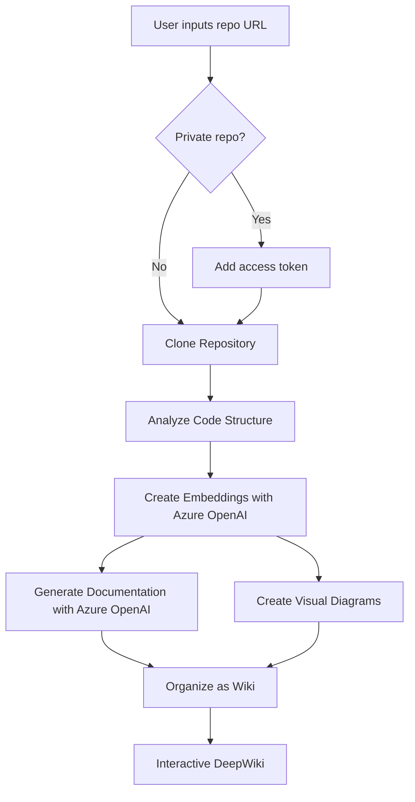

# DeepWiki-Open (Azure OpenAI Edition)


**DeepWiki** automatically creates beautiful, interactive wikis for any GitHub, GitLab, BitBucket, or Azure DevOps repository! Just enter a repo name, and DeepWiki will:

1. Analyze the code structure
2. Generate comprehensive documentation
3. Create visual diagrams to explain how everything works
4. Organize it all into an easy-to-navigate wiki

> **Note**: This fork is optimized exclusively for **Azure OpenAI** as the model provider.

[](https://buymeacoffee.com/sheing)

## ✨ Features

- **Instant Documentation**: Turn any GitHub, GitLab, BitBucket, or Azure DevOps repo into a wiki in seconds
- **Private Repository Support**: Securely access private repositories with personal access tokens
- **Smart Analysis**: AI-powered understanding of code structure and relationships
- **Beautiful Diagrams**: Automatic Mermaid diagrams to visualize architecture and data flow
- **Easy Navigation**: Simple, intuitive interface to explore the wiki
- **Ask Feature**: Chat with your repository using RAG-powered AI to get accurate answers
- **DeepResearch**: Multi-turn research process that thoroughly investigates complex topics
- **Azure OpenAI**: Enterprise-grade AI with Azure OpenAI Service

## 🚀 Quick Start

### Prerequisites

- **Python 3.10+**
- **Node.js 18+**
- **Azure OpenAI Service** with deployed models:
  - Text generation model (e.g., `o4-mini`, `gpt-4o`)
  - Embedding model (e.g., `text-embedding-3-large`)
- **Managed Identity (MSI)** configured with access to Azure OpenAI

### Step 1: Set Up Azure OpenAI

1. Go to [Azure Portal](https://portal.azure.com/)
2. Create an Azure OpenAI resource
3. Deploy your models (e.g., `o4-mini` for generation, `text-embedding-3-large` for embeddings)
4. Note your endpoint URL (e.g., `https://your-resource.openai.azure.com`)

### Step 2: Configure Managed Identity

1. Create a User-Assigned Managed Identity in Azure Portal
2. Grant the managed identity **Cognitive Services OpenAI User** role on your Azure OpenAI resource

### Step 3: Configure infra.json

Edit `api/config/infra.json` with your Azure details:

```json
{
  "managed_identity": {
    "name": "your-msi-name",
    "client_id": "your-msi-client-id"
  },
  "azure_openai": {
    "endpoint": "https://your-resource.openai.azure.com",
    "api_version": "2024-12-01-preview",
    "deployment": "o4-mini"
  },
  "azure_openai_embedding": {
    "endpoint": "https://your-resource.openai.azure.com",
    "api_version": "2024-12-01-preview",
    "deployment": "text-embedding-3-large"
  }
}
```

> **Note**: No `.env` file or API keys needed! All configuration is in `infra.json` and authentication is handled via Managed Identity (MSI).

### Step 4: Install Dependencies

```bash
# Clone the repository
git clone https://github.com/AsyncFuncAI/deepwiki-open.git
cd deepwiki-open

# Install Python dependencies (using Poetry)
python -m pip install poetry==2.0.1
poetry install -C api

# Install JavaScript dependencies
npm install
```

### Step 5: Start the Application

```bash
# Terminal 1: Start the API server
python -m api.main

# Terminal 2: Start the frontend
npm run dev
```

### Step 6: Use DeepWiki!

1. Open [http://localhost:3000](http://localhost:3000) in your browser
2. Enter a repository URL (e.g., `https://github.com/microsoft/autogen`)
3. For private repositories, click "+ Add access tokens" and enter your personal access token
4. Click "Generate Wiki" and watch the magic happen!

## 🐳 Docker Setup

### Using Docker Compose (Recommended)

```bash
# Edit api/config/infra.json with your Azure OpenAI configuration
# Then run with Docker Compose
docker-compose up
```

### Using Docker Run

```bash
# Mount your customized infra.json into the container
docker run -p 8001:8001 -p 3000:3000 \
  -v ./api/config/infra.json:/app/api/config/infra.json \
  -v ~/.adalflow:/root/.adalflow \
  ghcr.io/asyncfuncai/deepwiki-open:latest
```

> **Note**: When running in Docker on Azure (e.g., Azure Container Apps), MSI authentication is automatic. For local Docker, you may need to mount Azure CLI credentials.

## 🔍 How It Works


```mermaid
graph TD
    A[User inputs repo URL] --> AA{Private repo?}
    AA -->|Yes| AB[Add access token]
    AA -->|No| B[Clone Repository]
    AB --> B
    B --> C[Analyze Code Structure]
    C --> D[Create Embeddings with Azure OpenAI]
    D --> E[Generate Documentation with Azure OpenAI]
    D --> F[Create Visual Diagrams]
    E --> G[Organize as Wiki]
    F --> G
    G --> H[Interactive DeepWiki]
```

DeepWiki uses Azure OpenAI to:

1. Clone and analyze the repository (including private repos with token authentication)
2. Create embeddings of the code using Azure OpenAI's `text-embedding-3-large`
3. Generate documentation using Azure OpenAI's GPT models
4. Create visual diagrams to explain code relationships
5. Organize everything into a structured wiki
6. Enable intelligent Q&A with the repository through the Ask feature

## 🛠️ Project Structure

```
deepwiki/
├── api/                  # Backend API server
│   ├── main.py           # API entry point
│   ├── api.py            # FastAPI implementation
│   ├── rag.py            # Retrieval Augmented Generation
│   ├── data_pipeline.py  # Data processing utilities
│   ├── azureai_client.py # Azure OpenAI client
│   ├── config/           # Configuration files
│   │   ├── generator.json    # Model configuration
│   │   ├── embedder.json     # Embedding configuration
│   │   └── infra.json        # Infrastructure & MSI configuration
│   └── pyproject.toml    # Python dependencies (Poetry)
│
├── src/                  # Frontend Next.js app
│   ├── app/              # Next.js app directory
│   └── components/       # React components
│
└── docker-compose.yml    # Docker configuration
```

## ⚙️ Configuration

All configuration is centralized in `api/config/infra.json`. No `.env` file needed!

### infra.json Structure

| Field | Description |
|-------|-------------|
| `managed_identity.name` | Name of the User-Assigned Managed Identity |
| `managed_identity.client_id` | Client ID of the Managed Identity |
| `azure_openai.endpoint` | Azure OpenAI endpoint URL |
| `azure_openai.api_version` | API version (e.g., `2024-12-01-preview`) |
| `azure_openai.deployment` | Deployment name for text generation |
| `azure_openai_embedding.endpoint` | Azure OpenAI endpoint for embeddings |
| `azure_openai_embedding.api_version` | API version for embeddings |
| `azure_openai_embedding.deployment` | Deployment name for embeddings |

### Other Configuration Files

- **`api/config/generator.json`**: Text generation model parameters (temperature)
- **`api/config/embedder.json`**: Embedding model and text processing settings

## 📊 Logging

DeepWiki uses daily rotating log files:

- **Backend logs**: `api/logs/backend-YYMMDD.log`
- **Frontend logs**: `api/logs/frontend-YYMMDD.log`

Set logging level in your environment:

```bash
LOG_LEVEL=DEBUG  # DEBUG, INFO, WARNING, ERROR
```

## 🤖 Ask & DeepResearch Features

### Ask Feature

Chat with your repository using RAG (Retrieval Augmented Generation):

- **Context-Aware**: Get accurate answers based on the actual code
- **Real-Time Streaming**: See responses as they're generated
- **Conversation History**: Maintains context between questions

### DeepResearch Feature

Multi-turn research for complex topics:

- **In-Depth Investigation**: Multiple research iterations
- **Structured Process**: Clear research plan with updates
- **Comprehensive Conclusion**: Final answer based on all iterations

Toggle "Deep Research" in the Ask interface for thorough analysis.

## 📱 Screenshots


*The main interface of DeepWiki*


*Access private repositories with personal access tokens*


*DeepResearch conducts multi-turn investigations*

## ❓ Troubleshooting

### Azure OpenAI Issues

- **"Azure OpenAI API error"**: Verify your credentials (API key, endpoint, deployment name, version)
- **"Model not found"**: Ensure your deployment names match in `.env` and Azure Portal
- **"Rate limit exceeded"**: Check your Azure OpenAI quota and limits

### Connection Problems

- **"Cannot connect to API server"**: Ensure the API server is running on port 8001
- **"CORS error"**: Try running both frontend and backend on the same machine

### Generation Issues

- **"Error generating wiki"**: For very large repositories, try a smaller one first
- **"Could not fetch repository structure"**: For private repos, ensure valid access token
- **"Diagram rendering error"**: The app will automatically try to fix broken diagrams

### Common Solutions

1. **Check logs**: Look at `api/logs/backend-*.log` for detailed error messages
2. **Restart servers**: Sometimes a simple restart fixes most issues
3. **Verify Azure setup**: Ensure models are deployed and accessible in Azure Portal

## 🤝 Contributing

Contributions are welcome! Feel free to:
- Open issues for bugs or feature requests
- Submit pull requests to improve the code
- Share your feedback and ideas

## 📄 License

This project is licensed under the MIT License - see the [LICENSE](LICENSE) file for details.
