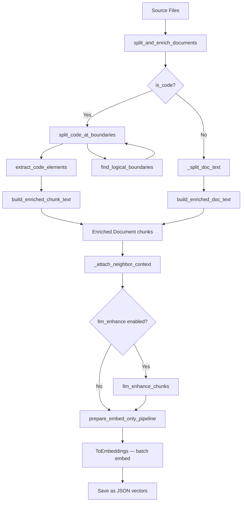
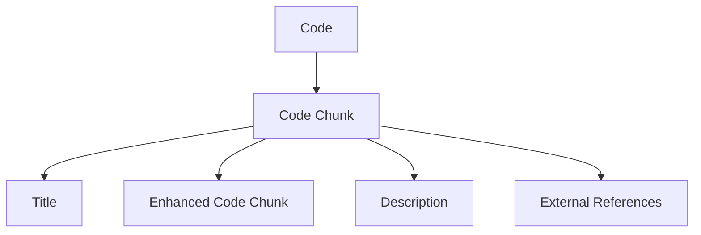

## Code Processing Explained

### Why a lightweight, language-agnostic code processing?

For large code bases, Abstract Syntax Trees (ASTs) can provide a comprehensive understanding of code interactions.
This is the basis of the GraphRAG mechanisms built for this codewiki.

However, this approach has limitations in some cases:

- **Language Support**: The current AST-based approaches leverage [Astred](https://dev.azure.com/FoSSE/Astred/_git/Astred?version=GBmain), which is limited to certain languages.
  - Languages like Kusto, SQL, Scala, React, PowerShell, YAML, JSON, bash, and more aren’t supported, which is a limitation for some teams (such as Spark, working with Scala) or teams heavily reliant on telemetry queries.
- **Setup Cost**: Setting up the pipeline can be costly and is not always necessary for small code bases.

This project aims to address the above problems.
The prototype removes Astred or other AST generators from the picture and relies solely on Large Language Models (LLMs).

This also eliminates the dependency on custom-built containers for a lightweight approach.

We can do this simplification thanks to two things:

- LLMs have a more global understanding of coding languages than humans due to their base training.
- Newer LLMs attention windows are sufficient to understand the majority of code source files.

---

## Current Implementation (Phase 1 — Regex-Based)

> **Module**: `backend/modules/rag/code_splitter.py` (676 lines)
> **Cost**: Zero additional LLM calls — all structural extraction uses compiled regex patterns.

### Architecture

```
backend/modules/rag/
├── code_splitter.py       # Boundary detection, element extraction, enrichment
├── document.py            # Pipeline orchestration (split → embed → save)
├── __init__.py            # Public API re-exports
│
backend/modules/chat/
├── service.py             # format_context_text() — structural metadata display
│
backend/promptstore/
├── wiki_page.py           # LLM instructions for interpreting structural metadata
```

### Data Flow



### Step-by-Step

#### Step 1: Boundary-Aware Splitting (`split_code_at_boundaries`)

Instead of a naive sliding window, code files are split at **logical boundaries**:

- **Function/class definitions** detected via 14 compiled regex patterns covering Python, JavaScript/TypeScript, Java/C#, Go, Rust, Ruby, and PHP.
- **Blank line separators** (2+ consecutive blank lines signal a new section).
- **Decorator blocks** (treated as part of the next definition).

Token parameters:

| Parameter | Default | Purpose |
|-----------|---------|---------|
| `target_tokens` | 2000 | Ideal chunk size |
| `max_tokens` | 2800 | Force-split threshold |
| `min_tokens` | 100 | Merge threshold for tiny chunks |

The algorithm groups consecutive boundary sections into chunks of ~2000 tokens, force-splits oversized sections at line boundaries, and merges tiny leftover sections into their neighbors.

#### Step 2: Structural Metadata Extraction (`extract_code_elements`)

Each chunk is analyzed with regex to extract:

- **Function names**: Python `def`, JS `function`, Java methods with access modifiers, Go `func`, Rust `fn`, etc.
- **Class names**: `class`, `struct`, `interface`, `enum`, `trait`, `impl`
- **Import statements**: First 5 imports, truncated to 80 chars

#### Step 3: Section Type Classification (`_detect_section_type`)

Each chunk is classified into one of:

| Type | Heuristic |
|------|-----------|
| `imports` | ≥50% of lines are import/require/using statements |
| `class` | Starts with class/struct/interface/enum keyword |
| `function` | Starts with function definition pattern |
| `declaration` | Contains export/const/var at top level |
| `configuration` | File is JSON/YAML/TOML/INI |
| `documentation` | File is .md/.txt/.rst |
| `code` | Default fallback |

#### Step 4: Enriched Embedding Text (`build_enriched_chunk_text`)

A structural context header is prepended to each chunk for embedding:

```
[File: src/rag/retriever.py | Language: Python | Section: function | Lines: 45-120]
[Defines: find_logical_boundaries, extract_code_elements]
<original code text>
```

The raw code text is preserved separately in `meta_data['raw_chunk_text']` for display — the LLM sees clean code in the prompt, while the vector index searches over the enriched text.

Documentation files receive a lighter prefix via `build_enriched_doc_text`:

```
[File: docs/setup.md | Type: documentation]
<original text>
```

#### Step 5: Neighbor Context Attachment (`_attach_neighbor_context`)

After all chunks for a file are created, each chunk is enriched with neighboring chunk text:

- `previous_chunks`: Raw text of up to 2 preceding chunks in the same file
- `next_chunks`: Raw text of up to 2 following chunks in the same file

This context is used by the LLM enhancement step (Step 6) to understand how each chunk fits within the file.

#### Step 6: Optional LLM Enhancement (`llm_enhance_chunks`)

> **Module**: `backend/modules/rag/chunk_enhancer.py`
> **Config**: `embedder.json` → `llm_enhance.enabled` (default: `false`)
> **Cost**: 2 LLM calls per code chunk (skips documentation chunks)

When enabled, each code chunk is enhanced with two LLM calls:

1. **Enhanced context**: Completes partial code snippets into full logical blocks (functions/classes) using neighboring chunk context. Returns a description FIRST, then the enhanced code.
2. **Key objects extraction**: Identifies up to 10 key codebase-specific references with name and description as JSON.

Token budget management prevents exceeding model limits — context is trimmed by alternately removing outer neighbor chunks. Chunks that hit content filters are gracefully skipped (excluded from output).

Configuration (`embedder.json`):

| Parameter | Default | Purpose |
|-----------|---------|--------|
| `llm_enhance.enabled` | `false` | Enable/disable LLM enhancement |
| `llm_enhance.max_output_enhanced` | `4096` | Max output tokens for enhanced context |
| `llm_enhance.max_output_key_objects` | `512` | Max output tokens for key objects |
| `llm_enhance.max_context_window` | `128000` | Max context window of the deployment |

#### Step 7: Embed-Only Pipeline (`prepare_embed_only_pipeline`)

The enriched chunks flow through `prepare_embed_only_pipeline()` — a pipeline that **only embeds** (no splitting), since splitting was already handled code-aware in Step 1. This replaces the legacy `prepare_data_pipeline()` which combined naive `TextSplitter` + embedding.

### Output Document Metadata

Each output `Document` carries extended metadata:

```python
{
    # Original fields preserved
    'file_path': str,
    'is_code': bool,
    'type': str,            # file extension
    # Enrichment fields (Phase 1)
    'raw_chunk_text': str,           # Clean code text for display
    'section_type': str,             # 'function', 'class', 'imports', etc.
    'start_line': int,               # 0-based start line in source file
    'end_line': int,                 # 0-based end line in source file
    'functions': List[str],          # Function names found in chunk
    'classes': List[str],            # Class names found in chunk
    'chunk_index': int,              # Position within this file's chunks
    'total_chunks_in_file': int,     # Total chunks from this file
    'previous_chunks': List[str],    # Raw text of preceding chunks
    'next_chunks': List[str],        # Raw text of following chunks
    # LLM enhancement fields (Phase 2 — only when enabled)
    'raw_content': str,              # Original text before LLM enhancement
    'key_external_objects': str,     # JSON array of {name, description}
    'llm_enhanced': bool,            # True if LLM enhancement was applied
}
```

### Downstream Usage

**RAG context formatting** (`service.py: format_context_text`):

Retrieved chunks are presented to the LLM with structural headers:

```
## File Path: src/rag/retriever.py
(Type: py | Classes: FAISSRetriever | Functions: search, build_index)

### [function] (lines 45-120)
<code>

### [class] (lines 1-42)
<code>
```

**Wiki page generation** (`promptstore/wiki_page.py`):

The wiki page prompt includes an `UNDERSTANDING THE SOURCE CONTEXT` block instructing the LLM to:
- Interpret file headers as source file indicators
- Use structural summaries to identify key components
- Recognize section markers (`[function]`, `[class]`) as code block type indicators
- Use line references for precise source citations

### Benefits Over Naive Splitting

| Aspect | Naive TextSplitter | Code-Aware Splitter |
|--------|-------------------|-------------------|
| Split boundaries | Arbitrary token count | Function/class definitions |
| Embedding quality | Raw text only | File path + language + section type + element names |
| LLM context | Flat code fragments | Structural headers, section markers, line refs |
| Cost | Zero | Zero (regex-only) |

---

## Phase 2 Implementation (LLM-Enhanced)

> **Status**: Implemented (opt-in). Set `llm_enhance.enabled: true` in `embedder.json` to activate.
> **Module**: `backend/modules/rag/chunk_enhancer.py`
> **Reference**: `backend/modules/rag/handling_embedder_ref.md`

### Design

Building on the Phase 1 boundary-aware chunks, a second pass uses LLM calls per code chunk to:

- **Generate descriptions**: A natural language summary of what the code does and how it fits in the file.
- **Complete code chunks**: Expand partial chunks to include the full logical block with proper boundaries.
- **Extract external references**: Identify cross-file dependencies and how they are used.

These add three new indexing dimensions: title, description, and references — enabling by-reference search.



### Phase Comparison

| Capability | Phase 1 (always on) | Phase 2 (opt-in) |
|-----------|-------------------|----------------------|
| Boundary detection | Regex (14 patterns, 8 languages) | Same |
| Element extraction | Regex | LLM (richer, more accurate) |
| Description | None | LLM-generated per chunk |
| Chunk completion | None | LLM expands partial blocks |
| Reference extraction | None | LLM identifies cross-file deps |
| Additional cost | Zero | 2 LLM calls per code chunk |

### Example (Phase 2)

#### a. Code chunk

Here is an example of code chunk extracted from the sliding window. This is from the [Arcas](https://aka.ms/arcas) codebase.

```csharp
if (!isPartial || this.AudiencePolicies.IsReturningPartialResults) {
    // Only pushing results if data isn't partial, or we want partial results.
    if (prioritizedRepoResults.HasActive || this.AudiencePolicies.IsReturningEmptyResults) {
        // Only pushing when data is active, or we want empty results.
        string output = JsonConvert.SerializeObject(prioritizedRepoResults, Formatting.Indented, new Newtonsoft.Json.Converters.StringEnumConverter());
        await RepoCoordinator.PushResultsToBlobAsync(output, this.CoordinatorId, prioritizedRepoResults.ScopingKeyId, this.AudiencePolicies, isPartial, log);
    }
}
```

As you can see, this code fragment is incomplete. It does not have a full description of what it does, nor does it explain what method this belongs to.

#### b. Code Chunk Enhancements

By doing an LLM call and feeding it the full file to which this snippet belongs to, we can enhance this code chunk:

```csharp
private async Task ProcessAndPushResultsAsync(bool isPartial, ILogger log) {
    try {
        if (!isPartial || this.AudiencePolicies.IsReturningPartialResults) {
            // Only pushing results if data isn't partial, or we want partial results.
            if (prioritizedRepoResults.HasActive || this.AudiencePolicies.IsReturningEmptyResults) {
                // Only pushing when data is active, or we want empty results.
                string output = JsonConvert.SerializeObject(prioritizedCodeResults, Formatting.Indented, new Newtonsoft.Json.Converters.StringEnumConverter());
                await RepoCoordinator.PushResultsToBlobAsync(output, this.CoordinatorId, prioritizedRepoResults.ScopingKeyId, this.AudiencePolicies, isPartial, log);
            }
        }
        // We are done processing results; we can write down any pending markers we may have.
        // We do this for successful Repos only.
        foreach (var successfulRepoId in this.Successes().Select(success => success.CodeLog.Template.Metadata.RepoId)) {
            await this.CodeSchedulerMetadataProvider.FlushMetadataAsync(successfulRepoId);
        }
    } catch (Exception ex) {
        log.LogError(new TelemetryEntry()
            .LogParameterName("RepoRestWorker")
            .LogAction("OutputGenerationFailure")
            .LogRepoCoordinatorId(this.CoordinatorId)
            .LogException(ex)
            .ToString());
    }
}
```

We now have a fully defined code chunk.

#### c. Description Generation

In addition, the LLM generates a textual description of the method and how it fits in the overall file.

For instance, here:

> This method processes and pushes results to a blob storage.
> It checks if the results are partial or if partial results should be returned, and then pushes the results to the blob storage depending on the audience policy used to run the `RepoCoordinator`.
> After processing the results, it flushes metadata for successful code repos and logs any exceptions that occur during the process.
> The code is encapsulated within a method to ensure proper execution flow and error handling, where error are logged but not raised.

#### d. External References

Finally, the LLM will also generate a list of external references. Those will be indexed separately.

For instance, here:

> - `RepoCoordinator`: A class or object responsible for coordinating code repo operations, including pushing results to blob storage.
> - `AudiencePolicies`: A property or object that contains policies related to the audience, such as whether partial or empty results should be returned.
> - `CodeSchedulerMetadataProvider`: A class or object responsible for managing and flushing metadata related to Code repo scheduling. This secheduler will be leveraging Azure ML pipeline in the future so it can automatically update repo to blob timely along with code repo changes.
> - `TelemetryEntry`: A class or object used for creating telemetry entries, which are logs that include detailed information about the application’s operation and errors.
